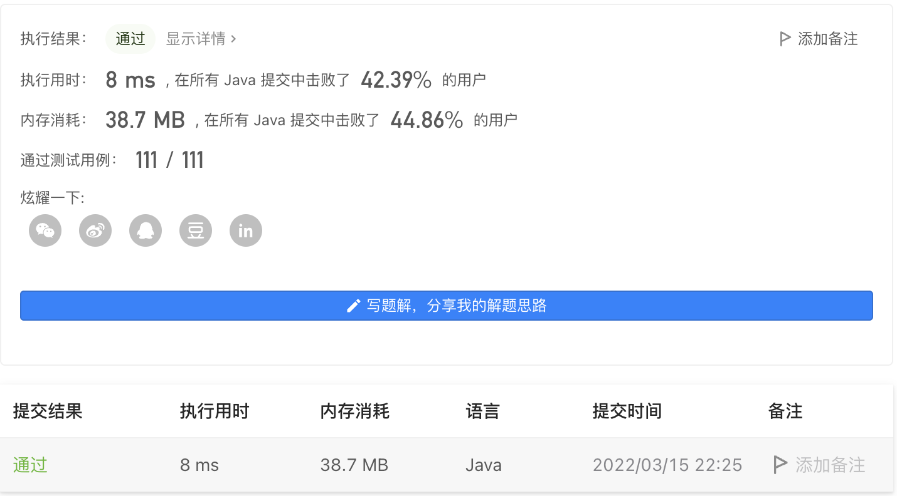

#### 2044. 统计按位或能得到最大值的子集数目

#### 2022-03-15 LeetCode每日一题

链接：https://leetcode-cn.com/problems/count-number-of-maximum-bitwise-or-subsets/

标签：**数组、位运算、回溯**

> 题目

给你一个整数数组 nums ，请你找出 nums 子集 按位或 可能得到的 最大值 ，并返回按位或能得到最大值的 不同非空子集的数目 。

如果数组 a 可以由数组 b 删除一些元素（或不删除）得到，则认为数组 a 是数组 b 的一个 子集 。如果选中的元素下标位置不一样，则认为两个子集 不同 。

对数组 a 执行 按位或 ，结果等于 a[0] OR a[1] OR ... OR a[a.length - 1]（下标从 0 开始）。 

示例 1：

```java
输入：nums = [3,1]
输出：2
解释：子集按位或能得到的最大值是 3 。有 2 个子集按位或可以得到 3 ：

- [3]
- [3,1]
```

示例 2：

```java
输入：nums = [2,2,2]
输出：7
解释：[2,2,2] 的所有非空子集的按位或都可以得到 2 。总共有 23 - 1 = 7 个子集。
```

示例 3：

```java
输入：nums = [3,2,1,5]
输出：6
解释：子集按位或可能的最大值是 7 。有 6 个子集按位或可以得到 7 ：

- [3,5]
- [3,1,5]
- [3,2,5]
- [3,2,1,5]
- [2,5]
- [2,1,5]
```


提示：

- 1 <= nums.length <= 16
- 1 <= nums[i] <= 10 ^ 5

> 分析

对于每个数无非就是选和不选两种状态。我们可以使用一个变量max记录当前最大的或值，变量count记录max对应的子集数。

使用回溯进行求解，从下标0开始，对每个数进行选和不选，当下标到最后时，判断此时的或值和max的大小，更新count。

> 编码

```java
class Solution {
    int max = 0, count = 0;
    public int countMaxOrSubsets(int[] nums) {
        backTrace(nums, 0, 0);
        return count;
    }

    private void backTrace(int[] nums, int index, int sum) {
        if (index == nums.length) {
            if (sum == max) {
                count++;
            } else if (sum > max) {
                count = 1;
                max = sum;
            }
            return;
        }
        // 不选nums[index]
        backTrace(nums, index + 1, sum);
        // 选择nums[index]
        backTrace(nums, index + 1, sum | nums[index]);
    }
}
```

