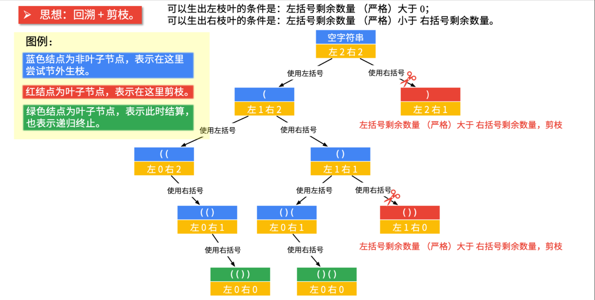

#### 22. 括号生成

链接：https://leetcode-cn.com/problems/generate-parentheses/

标签：**字符串、动态规划、回溯**

> 题目

数字 n 代表生成括号的对数，请你设计一个函数，用于能够生成所有可能的并且 有效的 括号组合。

有效括号组合需满足：左括号必须以正确的顺序闭合。

示例 1：

```java
输入：n = 3
输出：["((()))","(()())","(())()","()(())","()()()"]
```

示例 2：

```java
输入：n = 1
输出：["()"]
```


提示：

- 1 <= n <= 8

> 分析

[参考此处](https://leetcode-cn.com/problems/generate-parentheses/solution/hui-su-suan-fa-by-liweiwei1419/)



- 当前左右括号都有大于 0 个可以使用的时候，才产生分支；
- 产生左分支的时候，只看当前是否还有左括号可以使用；
- 产生右分支的时候，还受到左分支的限制，右边剩余可以使用的括号数量一定得在严格大于左边剩余的数量的时候，才可以产生分支；
- 在左边和右边剩余的括号数都等于 0 的时候结算。

> 编码

```java
class Solution {
    public List<String> generateParenthesis(int n) {
        List<String> list = new ArrayList<>();
        dfs("", n, n, list);
        return list;
    }

    /**
     * @param str 当前的括号组合
     * @param left 左括号的剩余数量 
     * @param right 右括号的剩余数量
     * @param list 结果集
     */
    private void dfs(String str, int left, int right, List<String> list) {
        if (left == 0 && right == 0) {
            list.add(str);
            return;
        }

        // 当左括号的数量大于右括号的时候，不是有效的括号组合，进行剪枝
        if (left > right) {
            return;
        }
        // str增加一个左括号的前提是left > 0
        if (left > 0) {
            dfs(str + "(", left - 1, right, list);
        }
        // str增加一个右括号的前提是left < right
        if (right > 0) {
            dfs(str + ")", left, right - 1, list);
        }
    }
}
```

