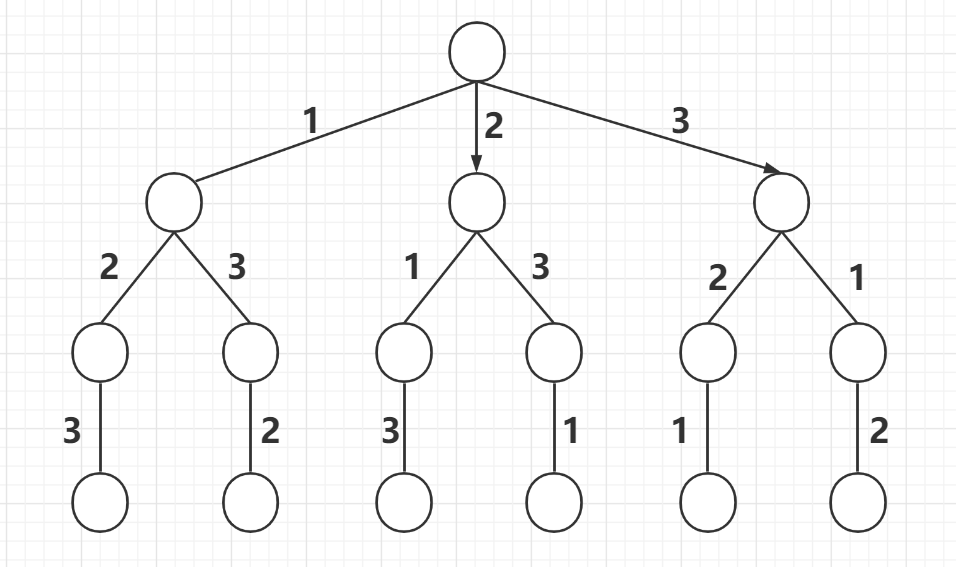
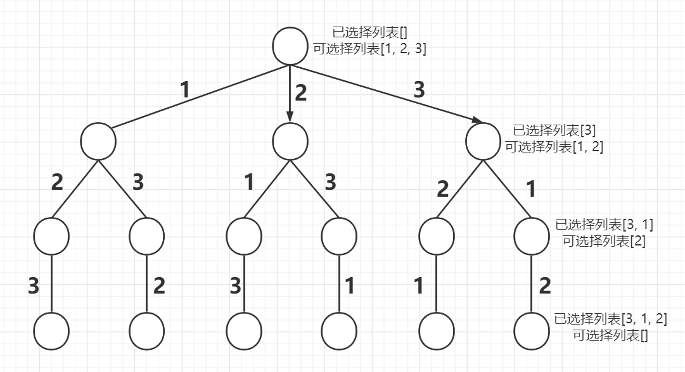
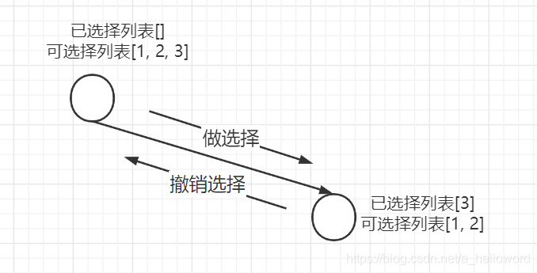
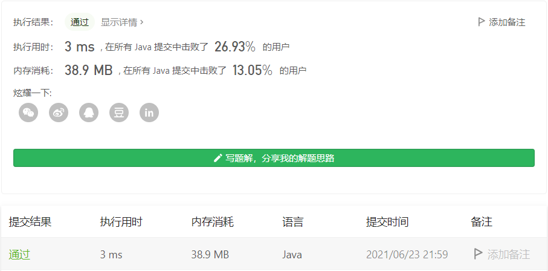

#### 46. 全排列

链接：https://leetcode-cn.com/problems/permutations/

标签：**回溯**

> 题目

给定一个不含重复数字的数组 `nums` ，返回其 **所有可能的全排列** 。你可以 **按任意顺序** 返回答案。

```java
输入：nums = [1,2,3]
输出：[[1,2,3],[1,3,2],[2,1,3],[2,3,1],[3,1,2],[3,2,1]]
    
输入：nums = [0,1]
输出：[[0,1],[1,0]]
    
输入：nums = [1]
输出：[[1]]
```

**提示：**

- `1 <= nums.length <= 6`
- `-10 <= nums[i] <= 10`
- `nums` 中的所有整数 **互不相同**

> 分析

求**全排列问题**，和求**组合问题**、**子集问题**一样，都可以使用回溯法解决。

对于集合[1, 2, 3]，如果让我们在纸上写的话，很容易可以写出来[1, 2, 3]，[1, 3, 2]，[2, 1, 3]，[2, 3, 1]，[3, 1, 2]，[3, 2, 1]

不妨抽象成下面这棵树



那么只需要从根节点开始遍历，记录路径上的数字，到叶子节点就得到了一个排序，遍历完这棵树，就得到了全排列。我们可以定义下面几个概念：

- 已选择列表：就是已经选择的元素。
- 可选择列表：就是可以选择的元素。



那么在这里，到叶子节点其实就是可选择列表为空的时候，此时就得到一个排序。就跟二叉树的遍历一样，到了叶子节点后，我们需要回到它的父节点，去走它的同胞节点。所以我们在得到一个全排列之后，再把已选择列表的元素一个个弹出来放到未选择列表，重新进行选择。



如果在给定的数组中存在重复元素，那么在求全排列的时候，就会有一些重复的排列，这时候我们只需要使用Set去保存结果，因为Set能够去重。可以看看 [剑指 Offer 38. 字符串的排列](https://leetcode-cn.com/problems/zi-fu-chuan-de-pai-lie-lcof/)，[47. 全排列 II](https://leetcode-cn.com/problems/permutations-ii/)，将这几题进行对比。

> 编码

```java
class Solution {
    List<List<Integer>> res = new LinkedList<>();
    public List<List<Integer>> permute(int[] nums) {
        LinkedList<Integer> track = new LinkedList<>();
        backTrace(nums, track);
        return res;
    }

    private void backTrace(int[] nums, LinkedList<Integer> track) {
        // 相等的时候，说明得到了一个全排列
        if (track.size() == nums.length) {
            res.add(new LinkedList(track));
            return;
        }

        for (int i = 0; i < nums.length; i++) {
            // 如果已经存在该元素，就不添加
            if (track.contains(nums[i])) {
                continue;
            }

            // 选择元素
            track.add(nums[i]);
            backTrace(nums, track);
            // 撤销选择
            track.removeLast();
        }
    }
}
```

