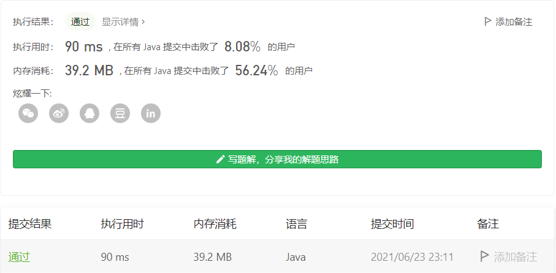

#### 47. 全排列 II

链接：https://leetcode-cn.com/problems/permutations-ii/

标签：**回溯**

> 题目

给定一个可包含重复数字的序列 `nums` ，**按任意顺序** 返回所有不重复的全排列。

```java
输入：nums = [1,1,2]
输出：
[[1,1,2],
 [1,2,1],
 [2,1,1]]
    
输入：nums = [1,2,3]
输出：[[1,2,3],[1,3,2],[2,1,3],[2,3,1],[3,1,2],[3,2,1]]
```

**提示：**

- `1 <= nums.length <= 8`
- `-10 <= nums[i] <= 10`

> 分析

此题和第46题：[46. 全排列](https://leetcode-cn.com/problems/permutations/)很像，但这题是包含重复数字，所以在计算的过程中需要去掉重复的排列。

这里跟46题的思路基本一致，具体思路我就不说了。在求解的过程中，有两个点需要注意：

- 不能用contains方法去判断list中是否存在重复元素了，这样势必会得不到一个排列。因为我们需要的是不重复的排列而不是不重复的元素，所以我们需要一个boolean数组通过下标去判断某个元素是否已经被加入已选择列表。
- 得到全部排列后，我们需要去掉重复的排序，这里可以把数据结构换成Set进行去重，然后再把Set换成List。不过这种方式是十分低效的，因为有很多无效的状态会被计算。最好的方法就是在回溯过程中进行剪枝，无效的状态直接跳过不计算。

> 编码

```java
class Solution {
    Set<List<Integer>> temp = new HashSet<>();
    public List<List<Integer>> permuteUnique(int[] nums) {
        LinkedList<Integer> list = new LinkedList<>();
        // 记录已经访问过的元素
        boolean[] visited = new boolean[nums.length];
        backTrace(nums, list, visited);
        List<List<Integer>> res = new LinkedList<>(temp);
        return res;
    }

    private void backTrace(int[] nums, LinkedList<Integer> list, boolean[] visited) {
        if (list.size() == nums.length) {
            temp.add(new LinkedList(list));
            return;
        }

        for (int i = 0; i < nums.length; i++) {
            if (visited[i]) {
                continue;
            }

            // 下标为i的元素已经访问过
            visited[i] = true;
            list.add(nums[i]);
            backTrace(nums, list, visited);
            // 移除list的元素同时将下标为i的元素置为未访问状态
            list.removeLast();
            visited[i] = false;
        }
    }
}
```



可以发现用Set去重效率十分的低。**需要考虑在回溯过程中进行剪枝，去掉一些无效的中间状态**。可以参考题解：https://leetcode-cn.com/problems/permutations-ii/solution/hui-su-suan-fa-python-dai-ma-java-dai-ma-by-liwe-2/。图文并茂，这里直接上代码

```java
class Solution {
    Set<List<Integer>> temp = new HashSet<>();
    public List<List<Integer>> permuteUnique(int[] nums) {
        LinkedList<Integer> list = new LinkedList<>();
        // 记录已经访问过的元素
        boolean[] visited = new boolean[nums.length];
        // 排序，方便剪枝
        Arrays.sort(nums);
        backTrace(nums, list, visited);
        List<List<Integer>> res = new LinkedList<>(temp);
        return res;
    }

    private void backTrace(int[] nums, LinkedList<Integer> list, boolean[] visited) {
        if (list.size() == nums.length) {
            temp.add(new LinkedList(list));
            return;
        }

        for (int i = 0; i < nums.length; i++) {
            if (visited[i]) {
                continue;
            }

            // 剪枝
            if (i > 0 && nums[i] == nums[i - 1] && !visited[i - 1]) {
                continue;
            }
            
            // 下标为i的元素已经访问过
            visited[i] = true;
            list.add(nums[i]);
            backTrace(nums, list, visited);
            // 移除list的元素同时将下标为i的元素置为未访问状态
            list.removeLast();
            visited[i] = false;
        }
    }
}
```


可以发现时间从90ms -> 4ms，但这个击败率。。。