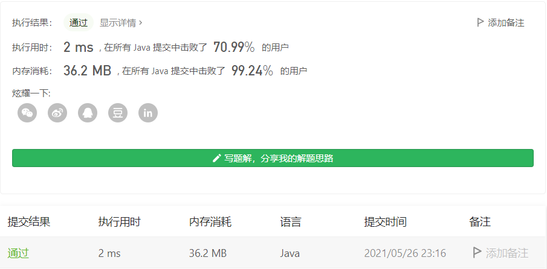

#### 1190. 反转每对括号间的子串

#### 2021-05-26 LeetCode每日一题

链接：https://leetcode-cn.com/problems/reverse-substrings-between-each-pair-of-parentheses/

标签：字符串、堆栈

> 题目

给出一个字符串 s（仅含有小写英文字母和括号）。

请你按照从括号内到外的顺序，逐层反转每对匹配括号中的字符串，并返回最终的结果。

注意，您的结果中 不应 包含任何括号。

```java
输入：s = "(abcd)"
输出："dcba"
    
输入：s = "(u(love)i)"
输出："iloveu"
    
输入：s = "(ed(et(oc))el)"
输出："leetcode"
    
输入：s = "a(bcdefghijkl(mno)p)q"
输出："apmnolkjihgfedcbq"
    
0 <= s.length <= 2000
s 中只有小写英文字母和括号
我们确保所有括号都是成对出现的
```

> 分析

这种括号匹配的，应该要想到使用栈解决。可以使用Java自带的ArrayDeque，也可以使用数组模拟实现。

对于此题，按照括号**从内到外**，逐层反转每对括号中的字符串。思路其实就是遇到一个括号，就把括号里的字符进行反转，但要注意得从内到外。

- 按照顺序把字符放入双端队列的底部，直到遇到一个)符号。
- 从双端队列底部依次把字符拿出来，直到遇到一个(符号。
- 把拿出来的字符串按顺序放入双端队列底部（按顺序放入底部，其实相当于反转了，因为后拿出来的放到了最底部）
- 重复上面三步，直到字符串结束，然后从双端队列顶依次拿出字符组成一个字符串返回即可。

> 编码

**使用ArrayDeque实现**：

```java
class Solution {
    public String reverseParentheses(String s) {
        Deque<Character> stack = new ArrayDeque<>();

        for (int i = 0; i < s.length(); i++) {
            char c = s.charAt(i);
            if (c != ')') {
                // 插入末尾
                stack.add(c);
            } else {
                // 从末尾取出，直到(
                StringBuilder sb = new StringBuilder();
                while (!stack.isEmpty()) {
                    if (stack.peekLast() != '(') {
                        sb.append(stack.pollLast());
                    } else {
                        // 丢掉(
                        stack.pollLast();
                        for (int j = 0; j < sb.length(); j++) {
                            stack.add(sb.charAt(j));
                        }
                        break;
                    }
                }
            }
        }

        StringBuilder res = new StringBuilder();
        while (!stack.isEmpty()) {
            // 从头取出
            res.append(stack.pollFirst());
        }   

        return res.toString();
    }
}
```

时间复杂度O(n^2)，空间复杂度O(n)


**使用数组实现**：

```java
class Solution {
    public String reverseParentheses(String s) {
        char[] chs = new char[2000];
        int tail = -1, head = 0;

        for (int i = 0; i < s.length(); i++) {
            char c = s.charAt(i);
            if (c != ')') {
                chs[++tail] = c;
            } else {
                // 从末尾取出，直到(
                StringBuilder sb = new StringBuilder();
                while (tail >= 0) {
                    if (chs[tail] != '(') {
                        sb.append(chs[tail--]);
                    } else {
                        // 丢掉(
                        tail--;
                        for (int j = 0; j < sb.length(); j++) {
                            chs[++tail] = sb.charAt(j);
                        }
                        break;
                    }
                }
            }
        }

        StringBuilder res = new StringBuilder();
        while (tail >= head) {
            // 从头取出
            res.append(chs[head++]);
        }   

        return res.toString();
    }
}
```

时间复杂度O(n^2)，空间复杂度O(n)

