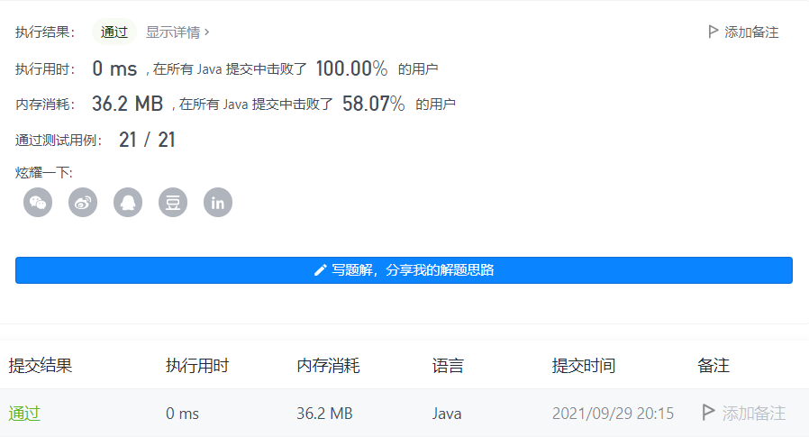

#### 232. 用栈实现队列

链接：https://leetcode-cn.com/problems/implement-queue-using-stacks/

标签：**栈、队列**

> 题目

请你仅使用两个栈实现先入先出队列。队列应当支持一般队列支持的所有操作（push、pop、peek、empty）：

实现 MyQueue 类：

- void push(int x) 将元素 x 推到队列的末尾
- int pop() 从队列的开头移除并返回元素
- int peek() 返回队列开头的元素
- boolean empty() 如果队列为空，返回 true ；否则，返回 false


说明：

- 你只能使用标准的栈操作 —— 也就是只有 push to top, peek/pop from top, size, 和 is empty 操作是合法的。
- 你所使用的语言也许不支持栈。你可以使用 list 或者 deque（双端队列）来模拟一个栈，只要是标准的栈操作即可。


进阶：

- 你能否实现每个操作均摊时间复杂度为 O(1) 的队列？换句话说，执行 n 个操作的总时间复杂度为 O(n) ，即使其中一个操作可能花费较长时间。


示例：

```java
输入：
["MyQueue", "push", "push", "peek", "pop", "empty"]
[[], [1], [2], [], [], []]
输出：
[null, null, null, 1, 1, false]

解释：
MyQueue myQueue = new MyQueue();
myQueue.push(1); // queue is: [1]
myQueue.push(2); // queue is: [1, 2] (leftmost is front of the queue)
myQueue.peek(); // return 1
myQueue.pop(); // return 1, queue is [2]
myQueue.empty(); // return false
```


提示：

- 1 <= x <= 9
- 最多调用 100 次 push、pop、peek 和 empty
- 假设所有操作都是有效的 （例如，一个空的队列不会调用 pop 或者 peek 操作）

> 分析

栈是后进先出的数据结构，而队列是先进先出的数据结构。这里我们使用两个栈实现一个队列，元素在进入栈1的时候是后进先出的顺序，那么我们把栈1的元素放入栈2后，从栈2取出元素的时候，其实就相当于先进先出了。

所以关键点就在于取出元素之前，需要把栈1的元素移到栈2，然后从栈2取元素。

> 编码

```java
class MyQueue {
    private Stack<Integer> stack1;
    private Stack<Integer> stack2;

    public MyQueue() {
        stack1 = new Stack<>();
        stack2 = new Stack<>();
    }
    
    public void push(int x) {
        stack1.push(x);
    }
    
    public int pop() {
        transfor();
        return stack2.pop();
    }
    
    public int peek() {
        transfor();
        return stack2.peek();
    }

    /**
     * 将stack1的元素转移到stack2
     * stack1的元素是后进先出，转移到stack2
     */
    private void transfor() {
        if (stack2.empty()) {
            while (!stack1.empty()) {
                stack2.push(stack1.pop());
            }
        }
    }
    
    public boolean empty() {
        return stack1.empty() && stack2.empty();
    }
}

/**
 * Your MyQueue object will be instantiated and called as such:
 * MyQueue obj = new MyQueue();
 * obj.push(x);
 * int param_2 = obj.pop();
 * int param_3 = obj.peek();
 * boolean param_4 = obj.empty();
 */
```

