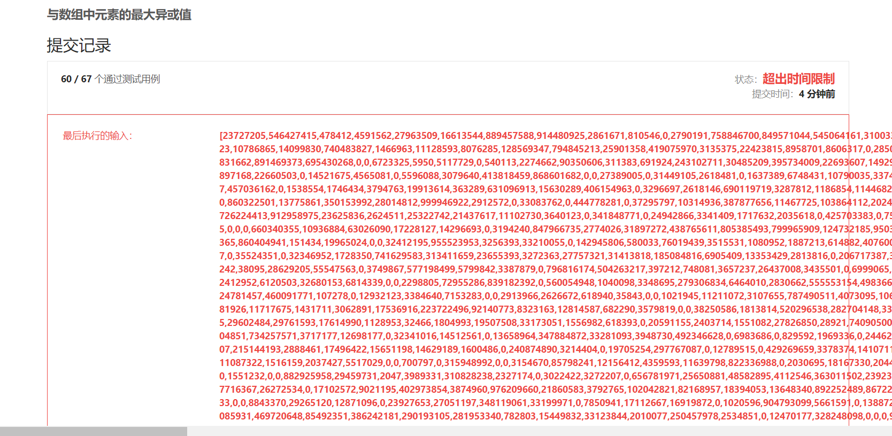

#### 1707. 与数组中元素的最大异或值

#### 2021-05-23 LeetCode每日一题

链接：https://leetcode-cn.com/problems/maximum-xor-with-an-element-from-array/

标签：**数组、异或、字典树**

> 题目

给你一个由非负整数组成的数组 nums 。另有一个查询数组 queries ，其中 queries[i] = [xi, mi] 。

第 i 个查询的答案是 xi 和任何 nums 数组中不超过 mi 的元素按位异或（XOR）得到的最大值。换句话说，答案是 max(nums[j] XOR xi) ，其中所有 j 均满足 nums[j] <= mi 。如果 nums 中的所有元素都大于 mi，最终答案就是 -1 。

返回一个整数数组 answer 作为查询的答案，其中 answer.length == queries.length 且 answer[i] 是第 i 个查询的答案。

```java
输入：nums = [0,1,2,3,4], queries = [[3,1],[1,3],[5,6]]
输出：[3,3,7]
解释：
1) 0 和 1 是仅有的两个不超过 1 的整数。0 XOR 3 = 3 而 1 XOR 3 = 2 。二者中的更大值是 3 。
2) 1 XOR 2 = 3.
3) 5 XOR 2 = 7.

输入：nums = [5,2,4,6,6,3], queries = [[12,4],[8,1],[6,3]]
输出：[15,-1,5]
    
1 <= nums.length, queries.length <= 10e5
queries[i].length == 2
0 <= nums[j], xi, mi <= 10e9
```

> 分析

这题如果用暴力的话，很容易就能写出来，就是会超时。

```java
class Solution {
    public int[] maximizeXor(int[] nums, int[][] queries) {
        int[] res = new int[queries.length];

        for (int i = 0; i < queries.length; i++) {
            int a = queries[i][0], b = queries[i][1], max = -1;
            for (int j = 0; j < nums.length; j++) {
                int temp = a;
                if (nums[j] <= b && ((temp ^ nums[j]) > max)) {
                    max = (temp ^ nums[j]);
                }
            }

            res[i] = max;
        }

        return res;
    }
}
```



时间复杂度是O(10e10)

所以这里使用暴力破解是不行的，需要使用**字典树**解决。关于字典树，可以先做一下这两题

- [208. 实现 Trie (前缀树)](https://leetcode-cn.com/problems/implement-trie-prefix-tree/)
- [421.数组中两个数的最大异或值](https://leetcode-cn.com/problems/maximum-xor-of-two-numbers-in-an-array/)

[421.数组中两个数的最大异或值](https://github.com/stronglxp/learnNote/blob/main/leetcode/%E5%AD%97%E5%85%B8%E6%A0%91/421.%E6%95%B0%E7%BB%84%E4%B8%AD%E4%B8%A4%E4%B8%AA%E6%95%B0%E7%9A%84%E6%9C%80%E5%A4%A7%E5%BC%82%E6%88%96%E5%80%BC.md) 的题解可以看一下[这篇文章](https://github.com/stronglxp/learnNote/blob/main/leetcode/%E5%AD%97%E5%85%B8%E6%A0%91/421.%E6%95%B0%E7%BB%84%E4%B8%AD%E4%B8%A4%E4%B8%AA%E6%95%B0%E7%9A%84%E6%9C%80%E5%A4%A7%E5%BC%82%E6%88%96%E5%80%BC.md) 这里就不重复说了。

在421题的基础上，我们可以求得某个范围内的数与某个数的最大异或值，这里稍微变通一下就行了。这题的题目是想求max(nums[j] XOR xi) ，其中所有 j 均满足 nums[j] <= mi。那这个范围就应该是一个有序范围，所以我们应该先对nums数组排序，这样就你方便求得max(nums[j] XOR xi)。

还有另一个问题就是queries[i] [1]是无序的，这样就不能利用前缀树，因为一会大一会小。所以也需要对queries[i] [1]进行排序，但在排序之前需要记录原来的下标，不然没法存。

> 编码

```java
class Solution {
    class Tree {
        // 左节点，存放位数为0的
        Tree left = null;
        // 右节点，存放位数为1的
        Tree right = null;
    }

    private static final int MAX_BIT = 31;
    Tree root = new Tree();

    /**
     * 将num拆分为32位存入tree
     */
    private void split(int num) {
        Tree res = root;
        for (int i = MAX_BIT; i >= 0; --i) {
            int bit = (num >> i) & 1;
            // 放在右节点
            if (bit == 1) {
                if (res.right == null) {
                    res.right = new Tree();
                }
                res = res.right;
            } else {
                if (res.left == null) {
                    res.left = new Tree();
                }
                res = res.left;
            }
        }
    }

    /**
     * 计算num与小于它的数的最大亦或值
     */
    private int maxAdd(int num) {
        Tree node = root;
        int res = 0;
        for (int i = MAX_BIT; i >= 0; --i) {
            int bit = (num >> i) & 1;
            if (bit == 1) {
                if (node.left != null) {
                    res = res * 2 + 1;
                    node = node.left;
                } else {
                    res = res * 2;
                    node = node.right;
                }
            } else {
                if (node.right != null) {
                    res = res * 2 + 1;
                    node = node.right;
                } else {
                    res = res * 2;
                    node = node.left;
                }
            }
        }
        return res;
    }

    public int[] maximizeXor(int[] nums, int[][] queries) {
        int[] res = new int[queries.length];
        // 保存queries排序前的下标
        Map<int[], Integer> map = new HashMap<>();
        for (int i = 0; i < queries.length; i++) {
            map.put(queries[i], i);
        }

        // 升序
        Arrays.sort(nums);
        // queries[i][1]从小到大排序
        Arrays.sort(queries, (a, b) -> a[1] - b[1]);
        // 记录nums数组中，加入字典数的个数
        int count = 0;
        
        for (int i = 0; i < queries.length; i++) {
            int a = queries[i][0], b = queries[i][1];
            if (nums[0] > b) {
                res[map.get(queries[i])] = -1;
                continue;
            }
            
            // [0, count)的数都已经存入树中
            while (count < nums.length && nums[count] <= b) {
                split(nums[count++]);
            }
            
            res[map.get(queries[i])] = maxAdd(a);
        }

        return res;
    }
}
```

