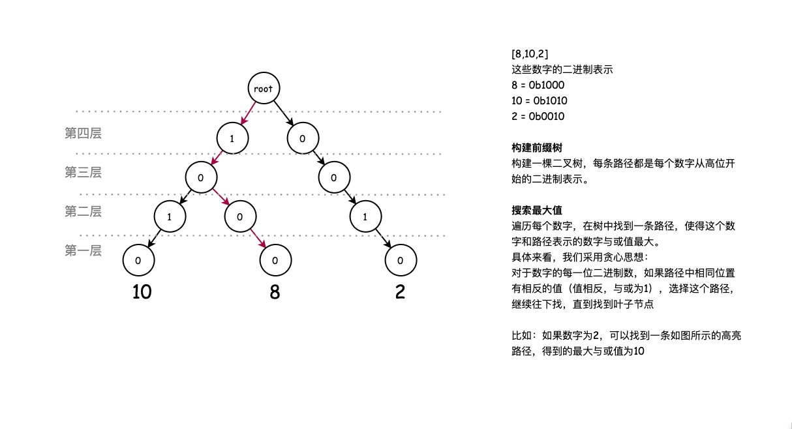
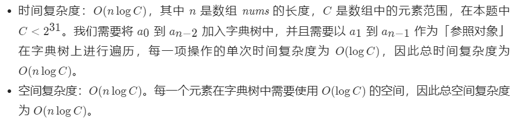

#### 421. 数组中两个数的最大异或值

链接：https://leetcode-cn.com/problems/maximum-xor-of-two-numbers-in-an-array/

标签：**位运算、字典树。**

> 题目

给你一个整数数组 nums ，返回 nums[i] XOR nums[j] 的最大运算结果，其中 0 ≤ i ≤ j < n 。

进阶：你可以在 O(n) 的时间解决这个问题吗？

```java
输入：nums = [3,10,5,25,2,8]
输出：28
解释：最大运算结果是 5 XOR 25 = 28.
    
输入：nums = [0]
输出：0
    
输入：nums = [2,4]
输出：6
    
输入：nums = [8,10,2]
输出：10
    
输入：nums = [14,70,53,83,49,91,36,80,92,51,66,70]
输出：127
    
1 <= nums.length <= 2 * 10^4
0 <= nums[i] <= 2^31 - 1
```

> 分析

不会字典树怎么办？直接暴力呗，过不过听天由命。

**暴力法**：

```java
class Solution {
    public int findMaximumXOR(int[] nums) {
        int res = 0;
        for (int i = 0; i < nums.length; i++) {
            int temp = nums[i];
            for (int j = i + 1; j < nums.length; j++) {
                res = Math.max(temp ^ nums[j], res);
            }
        }
        return res;
    }
}
```

时间复杂度O(n ^ n)，空间复杂度O(1)


一般情况下，暴力破解肯定是要凉凉的。所以有必要学习一下字典树怎么解决这类问题。

Trie，又称前缀树或字典树，是一棵有根树。对于这题，我们可以将每个数转换成二进制的形式01，那么就可以用一颗二叉树表示一个数，定义左节点指向0，右节点指向1，那么从根节点到叶子节点总共有33层（加上root，32位表示一个数，不足的补0）。



那么对于题目要求的【给你一个整数数组 nums ，返回 nums[i] XOR nums[j] 的最大运算结果，其中 0 ≤ i ≤ j < n 。】遍历数组，将每个数进行拆分存入字典树，对于任意下标j，下标[0, j - 1]的数都已经存入了数中，只需要拆分num[j]然后逐层去匹配，尽量保证num[j]的每一位和树的每一层值不一样，这样异或后结果为1，遍历完每一位后，得到的数就是【nums[i] XOR nums[j] 的最大运算结果，其中 0 ≤ i ≤ j < n 】。

```java
class Solution {
    class Tree {
        // 左节点，指向的位数为0
        Tree left = null;
        // 右节点，指向的位数为1
        Tree right = null;
    }

    // 全局变量，一直累计前面数的值
    Tree root = new Tree();
    private static final int MAX_BIT = 31;

    /**
     * 这个函数是计算num的各个位数，将每一位存入tree中
     */
    private void split(int num) {
        // 赋值全局变量，在root的基础上将num进行拆分，这样在num之前的数，已经存入了tree
        Tree node = root;
        // 将num从高到低位存入
        for (int i = MAX_BIT; i >= 0; i--) {
            int bit = (num >> i) & 1;
            // 这一位为1，存入右节点
            if (bit == 1) {
                if (node.right == null) {
                    node.right = new Tree();
                }
                node = node.right;
            } else {
                if (node.left == null) {
                    node.left = new Tree();
                }
                node = node.left;
            }
        }
    }

    /**
     * 假设num对应的下标为i，那么这个函数是为了求得nums[i]与num[j]的最大亦或值
     * 其中j <= i，[0, j]下标对应的数，都已经按位拆分到了tree中，
     * 这里只需要从高位开始，拆分num，对于每一位，只需要在tree中找到与num相反的位，异或即为1，
     * 如此下来，每一层尽量让亦或值为1，得到的就是最大的异或值。
     * 注意：从tree的根节点到叶子节点，表示一个数。
     */
    private int maxAdd(int num) {
        Tree node = root;
        int res = 0;
        for (int i = MAX_BIT; i >= 0; i--) {
            int bit = (num >> i) & 1;
            // num该位为1，要找tree中的左节点即0
            if (bit == 1) {
                if (node.left != null) {
                    res = res * 2 + 1;
                    node = node.left;
                } else {
                    res = res * 2;
                    node = node.right;
                }
            } else {
                if (node.right != null) {
                    res = res * 2 + 1;
                    node = node.right;
                } else {
                    res = res * 2;
                    node = node.left;
                }
            }
        }

        return res;
    }

    public int findMaximumXOR(int[] nums) {
        int max = 0;
        for (int i = 1; i < nums.length; i++) {
            // 下标[0, i - 1]的数都会存在Tree中
            split(nums[i - 1]);
            max = Math.max(max, maxAdd(nums[i]));
        }

        return max;
    }
}
```




