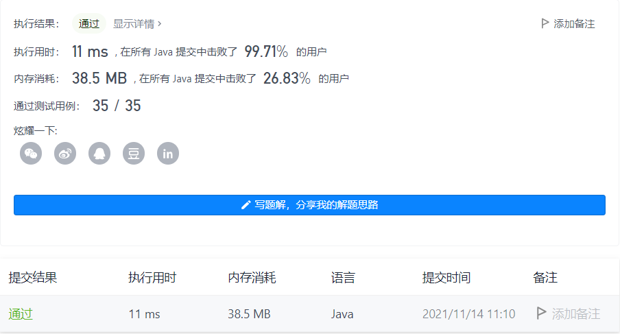

#### 677. 键值映射

#### 2021-11-14 LeetCode每日一题

链接：https://leetcode-cn.com/problems/map-sum-pairs/

标签：**设计、字典树、哈希表、字符串**

> 题目

实现一个 MapSum 类，支持两个方法，insert 和 sum：

- MapSum() 初始化 MapSum 对象
- void insert(String key, int val) 插入 key-val 键值对，字符串表示键 key ，整数表示值 val 。如果键 key 已经存在，那么原来的键值对将被替代成新的键值对。
- int sum(string prefix) 返回所有以该前缀 prefix 开头的键 key 的值的总和。


示例：

```java
输入：
["MapSum", "insert", "sum", "insert", "sum"]
[[], ["apple", 3], ["ap"], ["app", 2], ["ap"]]
输出：
[null, null, 3, null, 5]

解释：
MapSum mapSum = new MapSum();
mapSum.insert("apple", 3);  
mapSum.sum("ap");           // return 3 (apple = 3)
mapSum.insert("app", 2);    
mapSum.sum("ap");           // return 5 (apple + app = 3 + 2 = 5)
```


提示：

- 1 <= key.length, prefix.length <= 50
- key 和 prefix 仅由小写英文字母组成
- 1 <= val <= 1000
- 最多调用 50 次 insert 和 sum

> 分析

解法1：直接使用语言自带的Map数据结构。这应该不是面试官想看到的吧。

解法2：相同前缀，可以用前缀树做。具体看注释

> 编码

解法1：

```java
class MapSum {
    Map<String, Integer> map;
    public MapSum() {
        map = new HashMap<>();
    }
    
    public void insert(String key, int val) {
        map.put(key, val);
    }
    
    public int sum(String prefix) {
        int ans = 0;
        for (Map.Entry<String, Integer> entry: map.entrySet()) {
            if (entry.getKey().startsWith(prefix)) {
                ans += entry.getValue();
            }
        }

        return ans;
    }
}

/**
 * Your MapSum object will be instantiated and called as such:
 * MapSum obj = new MapSum();
 * obj.insert(key,val);
 * int param_2 = obj.sum(prefix);
 */
```



解法2：

```java
class MapSum {
    // 表示树形结构
    int[][] tree;
    // 每个key对应的值
    int[] vals;
    // 字符的下标
    int index;
    public MapSum() {
        // 最多调用50次insert，每个key最长为50，所以index最大为2500
        // 26表示26个小写字符
        tree = new int[2500][26];
        // index最多2500
        vals = new int[2500];
        /**
         * 
         *      a        b       c       d       ...
         *    / | \ \
         *  / / | \ \ \
         * a b  c  d e f  ...
         */
        index = 0;
    }
    
    public void insert(String key, int val) {
        // 可以理解为树的层数，每个key先从第0层开始找
        // 如果没找到，则这个key就是从index开始存的
        int p = 0;
        for (char c : key.toCharArray()) {
            int num = c - 'a';
            if (tree[p][num] == 0) {
                tree[p][num] = ++index;
            }
            p = tree[p][num];
        }
        // 记录key对应的val
        vals[p] = val;
    }
    
    public int sum(String prefix) {
        // 先遍历prefixd到具体的index上
        int p = 0;
        for (char c : prefix.toCharArray()) {
            int num = c - 'a';
            // 如果为0，说明不存在c这个字符，则不可能存在前缀为prefix的key，直接返回0
            if (tree[p][num] == 0) {
                return 0;
            }
            p = tree[p][num];
        }

        return dfs(p);
    }

    private int dfs(int p) {
        // ans初始化为p表示的key所对应的val
        int ans = vals[p];
        // 递归遍历p所表示的节点下所有的子节点
        for (int i = 0; i < 26; i++) {
            // 说明存在
            if (tree[p][i] != 0) {
                // 直接加上tree[p][i]对应的key的val。如果不是一个完整的key，则vals[p] = 0
                ans += dfs(tree[p][i]);
            }
        }

        return ans;
    }
}

/**
 * Your MapSum object will be instantiated and called as such:
 * MapSum obj = new MapSum();
 * obj.insert(key,val);
 * int param_2 = obj.sum(prefix);
 */
```

