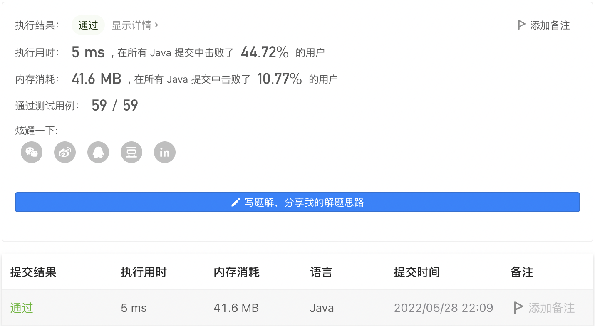

#### 1021. 删除最外层的括号

#### 2022-05-28 LeetCode每日一题

链接：https://leetcode.cn/problems/remove-outermost-parentheses/

标签：**栈、字符串**

> 题目

有效括号字符串为空 ""、"(" + A + ")" 或 A + B ，其中 A 和 B 都是有效的括号字符串，+ 代表字符串的连接。

- 例如，""，"()"，"(())()" 和 "(()(()))" 都是有效的括号字符串。

如果有效字符串 s 非空，且不存在将其拆分为 s = A + B 的方法，我们称其为原语（primitive），其中 A 和 B 都是非空有效括号字符串。

给出一个非空有效字符串 s，考虑将其进行原语化分解，使得：s = P_1 + P_2 + ... + P_k，其中 P_i 是有效括号字符串原语。

对 s 进行原语化分解，删除分解中每个原语字符串的最外层括号，返回 s 。

示例 1：

```java
输入：s = "(()())(())"
输出："()()()"
解释：
输入字符串为 "(()())(())"，原语化分解得到 "(()())" + "(())"，
删除每个部分中的最外层括号后得到 "()()" + "()" = "()()()"。
```

示例 2：

```java
输入：s = "(()())(())(()(()))"
输出："()()()()(())"
解释：
输入字符串为 "(()())(())(()(()))"，原语化分解得到 "(()())" + "(())" + "(()(()))"，
删除每个部分中的最外层括号后得到 "()()" + "()" + "()(())" = "()()()()(())"。
```

示例 3：

```java
输入：s = "()()"
输出：""
解释：
输入字符串为 "()()"，原语化分解得到 "()" + "()"，
删除每个部分中的最外层括号后得到 "" + "" = ""。
```


提示：

- 1 <= s.length <= 10 ^ 5
- s[i] 为 '(' 或 ')'
- s 是一个有效括号字符串

> 分析

利用栈后进先出的特点，如果是“(”并且栈中的元素个数大于0，则入栈并且记录该元素，如果是“)”并且栈中元素大于1，则说明此时栈中不止一个“(”，记录该元素并且弹出栈顶的“(”。当栈为空的时候，说明得到了一个有效括号字符串原语。

> 编码

```java
class Solution {
    public String removeOuterParentheses(String s) {
        StringBuilder sb = new StringBuilder();
        Deque<Character> queue = new LinkedList<>();
        char[] chs = s.toCharArray();

        for (char c : chs) {
            if (c == '(') {
                if (queue.size() >= 1) {
                    sb.append(c);
                }
                queue.addFirst(c);
            } else {
                if (queue.size() > 1) {
                    sb.append(")");
                }
                queue.poll();
            }
        }

        return sb.toString();
    }
}
```

