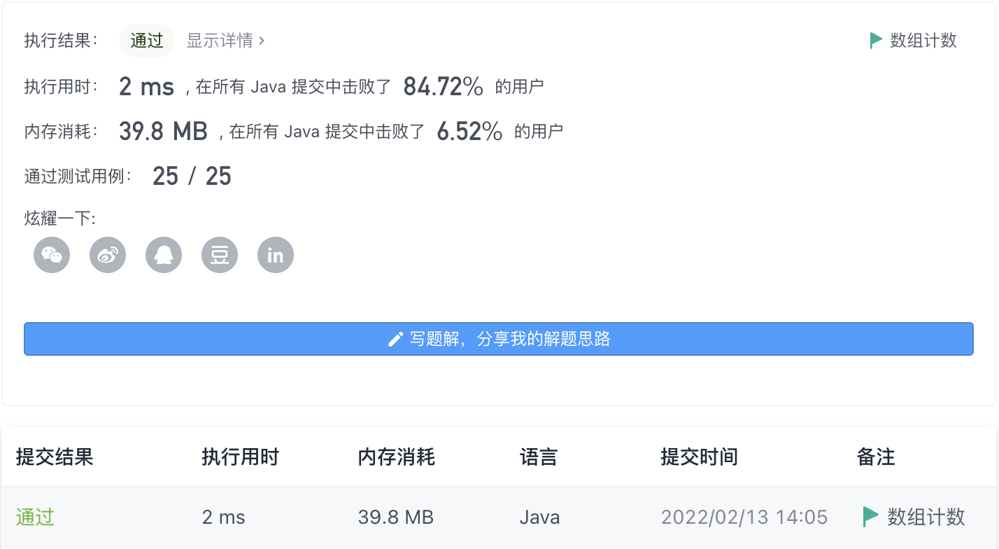

#### 1189. “气球” 的最大数量

#### 2022-02-13 LeetCode每日一题

链接：https://leetcode-cn.com/problems/maximum-number-of-balloons/

标签：字符串、哈希表、计数

> 题目

给你一个字符串 text，你需要使用 text 中的字母来拼凑尽可能多的单词 "balloon"（气球）。

字符串 text 中的每个字母最多只能被使用一次。请你返回最多可以拼凑出多少个单词 "balloon"。

示例 1：


```java
输入：text = "nlaebolko"
输出：1
```

示例 2：


```java
输入：text = "loonbalxballpoon"
输出：2
```

示例 3：

```java
输入：text = "leetcode"
输出：0
```


提示：

- 1 <= text.length <= 10^4
- text 全部由小写英文字母组成

> 分析

解法1：哈希表计数。

解法2：数组计数。

> 编码

解法1:

```java
class Solution {
    public int maxNumberOfBalloons(String text) {
        int ans = 0;
        Map<Character, Integer> map = new HashMap<>();

        for (char c : text.toCharArray()) {
            map.put(c, map.getOrDefault(c, 0) + 1);
        }

        int b = map.getOrDefault('b', 0);
        int a = map.getOrDefault('a', 0);
        int l = map.getOrDefault('l', 0);
        int o = map.getOrDefault('o', 0);
        int n = map.getOrDefault('n', 0);
        ans = Math.min(n, Math.min(b, a));
        ans = Math.min(ans, Math.min(l / 2, o / 2));

        return ans;
    }
}
```


解法2:

```java
class Solution {
    public int maxNumberOfBalloons(String text) {
        int ans = 0;
        int[] count = new int[5];

        for (char c : text.toCharArray()) {
            if (c == 'a') count[0]++;
            else if (c == 'b') count[1]++;
            else if (c == 'l') count[2]++;
            else if (c == 'n') count[3]++;
            else if (c == 'o') count[4]++;
        }

        int b = count[1];
        int a = count[0];
        int l = count[2];
        int o = count[4];
        int n = count[3];
        ans = Math.min(n, Math.min(b, a));
        ans = Math.min(ans, Math.min(l / 2, o / 2));

        return ans;
    }
}
```

