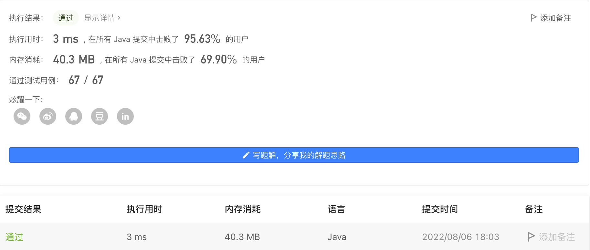

#### 1408. 数组中的字符串匹配

#### 2022-08-06 LeetCode每日一题

链接：https://leetcode.cn/problems/string-matching-in-an-array/

标签：**字符串、字符串匹配**

> 题目

给你一个字符串数组 words ，数组中的每个字符串都可以看作是一个单词。请你按 任意 顺序返回 words 中是其他单词的子字符串的所有单词。

如果你可以删除 words[j] 最左侧和/或最右侧的若干字符得到 word[i] ，那么字符串 words[i] 就是 words[j] 的一个子字符串。

示例 1：

```java
输入：words = ["mass","as","hero","superhero"]
输出：["as","hero"]
解释："as" 是 "mass" 的子字符串，"hero" 是 "superhero" 的子字符串。
["hero","as"] 也是有效的答案。
```

示例 2：

```java
输入：words = ["leetcode","et","code"]
输出：["et","code"]
解释："et" 和 "code" 都是 "leetcode" 的子字符串。
```

示例 3：

```java
输入：words = ["blue","green","bu"]
输出：[]
```


提示：

- 1 <= words.length <= 100
- 1 <= words[i].length <= 30
- words[i] 仅包含小写英文字母。
- 题目数据 保证 每个 words[i] 都是独一无二的。

> 分析

根据题目的数据量，这里直接使用暴力应该也没问题。注意一个单词可能是多个单词的子字符串，这时候你只需要添加一次即可，所以在匹配上之后可以立即break

> 编码

```java
class Solution {
    public List<String> stringMatching(String[] words) {
        List<String> res = new ArrayList<>();
        for (int i = 0; i < words.length; i++) {
            for (int j = 0; j < words.length; j++) {
                if (j != i && words[j].contains(words[i])) {
                    res.add(words[i]);
                    break;
                }
            }
        }

        return res;
    }
}
```

