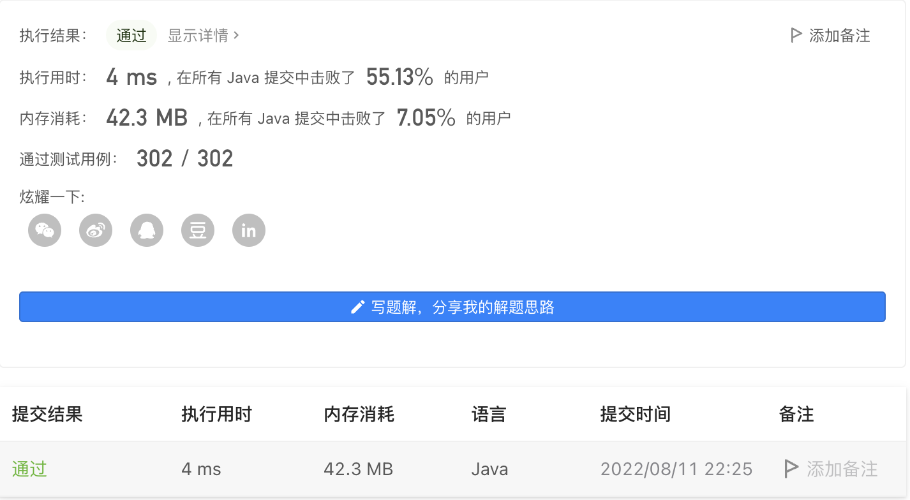

#### 1417. 重新格式化字符串

#### 2022-08-11 LeetCode每日一题

链接：https://leetcode.cn/problems/reformat-the-string/

标签：**字符串**

> 题目

给你一个混合了数字和字母的字符串 s，其中的字母均为小写英文字母。

请你将该字符串重新格式化，使得任意两个相邻字符的类型都不同。也就是说，字母后面应该跟着数字，而数字后面应该跟着字母。

请你返回 重新格式化后 的字符串；如果无法按要求重新格式化，则返回一个 空字符串 。 

示例 1：

```java
输入：s = "a0b1c2"
输出："0a1b2c"
解释："0a1b2c" 中任意两个相邻字符的类型都不同。 "a0b1c2", "0a1b2c", "0c2a1b" 也是满足题目要求的答案。
```

示例 2：

```java
输入：s = "leetcode"
输出：""
解释："leetcode" 中只有字母，所以无法满足重新格式化的条件。
```

示例 3：

```java
输入：s = "1229857369"
输出：""
解释："1229857369" 中只有数字，所以无法满足重新格式化的条件。
```

示例 4：

```java
输入：s = "covid2019"
输出："c2o0v1i9d"
```

示例 5：

```java
输入：s = "ab123"
输出："1a2b3"
```


提示：

- 1 <= s.length <= 500
- s 仅由小写英文字母和/或数字组成。

> 分析

可以把s中的字母和数字分开，然后判断两者的长度，如果相等或者相差1，那么可以重新格式化，否则返回空字符串。

然后合并两者，长度更长的需要放在前面。

> 编码

```java
class Solution {
    public String reformat(String s) {
        List<Character> digit = new ArrayList<>();
        List<Character> letter = new ArrayList<>();
        char[] ch = s.toCharArray();
        for (char c : ch) {
            if (Character.isDigit(c)) {
                digit.add(c);
            } else {
                letter.add(c);
            }
        }

        if (Math.abs(digit.size() - letter.size()) > 1) {
            return "";
        }

        StringBuilder sb = new StringBuilder();
        int i = 0, j = 0;
        if (digit.size() > letter.size()) {
            sb.append(digit.get(0));
            i = 1;
        } else {
            sb.append(letter.get(0));
            j = 1;
        }

        while (i < digit.size() && j < letter.size()) {
            if (i > j) {
                sb.append(letter.get(j));
                sb.append(digit.get(i));
            } else {
                sb.append(digit.get(i));
                sb.append(letter.get(j));
            }
            i++;
            j++;
        }
        
        if (i < digit.size()) {
            sb.append(digit.get(i));
        }
        if (j < letter.size()) {
            sb.append(letter.get(j));
        }

        return sb.toString();
    }
}
```

