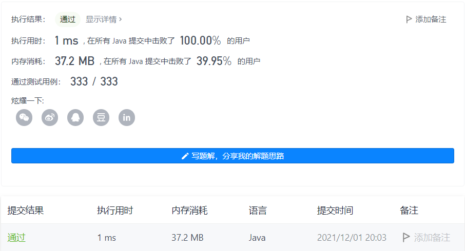

#### 1446. 连续字符

#### 2021-12-01 LeetCode每日一题

链接：https://leetcode-cn.com/problems/consecutive-characters/

标签：**字符串**

> 题目

给你一个字符串 s ，字符串的「能量」定义为：只包含一种字符的最长非空子字符串的长度。

请你返回字符串的能量。 

示例 1：

```java
输入：s = "leetcode"
输出：2
解释：子字符串 "ee" 长度为 2 ，只包含字符 'e' 。
```

示例 2：

```java
输入：s = "abbcccddddeeeeedcba"
输出：5
解释：子字符串 "eeeee" 长度为 5 ，只包含字符 'e' 。
```

示例 3：

```java
输入：s = "triplepillooooow"
输出：5
```

示例 4：

```java
输入：s = "hooraaaaaaaaaaay"
输出：11
```

示例 5：

```java
输入：s = "tourist"
输出：1
```


提示：

- 1 <= s.length <= 500
- s 只包含小写英文字母。

> 分析

直接使用两个变量记录当前连续字母的长度以及最大长度。

> 编码

```java
class Solution {
    public int maxPower(String s) {
        int max = 1, len = 1;
        for (int i = 1; i < s.length(); i++) {
            if (s.charAt(i) == s.charAt(i - 1)) {
                len++;
            } else {
                max = Math.max(max, len);
                len = 1;
            }
        }

        return Math.max(max, len);
    }
}
```

