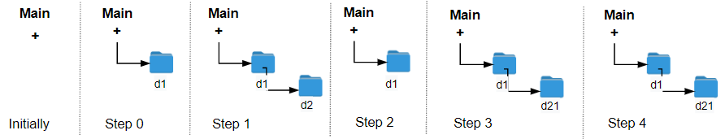

#### 1598. 文件夹操作日志搜集器

#### 2022-09-09 LeetCode每日一题

链接：https://leetcode.cn/problems/crawler-log-folder/

标签：**字符串**

> 题目

每当用户执行变更文件夹操作时，LeetCode 文件系统都会保存一条日志记录。

下面给出对变更操作的说明：

- "../" ：移动到当前文件夹的父文件夹。如果已经在主文件夹下，则 继续停留在当前文件夹 。
- "./" ：继续停留在当前文件夹。
- "x/" ：移动到名为 x 的子文件夹中。题目数据 保证总是存在文件夹 x 。

给你一个字符串列表 logs ，其中 logs[i] 是用户在 ith 步执行的操作。

文件系统启动时位于主文件夹，然后执行 logs 中的操作。

执行完所有变更文件夹操作后，请你找出 返回主文件夹所需的最小步数 。

示例 1：



```java
输入：logs = ["d1/","d2/","../","d21/","./"]
输出：2
解释：执行 "../" 操作变更文件夹 2 次，即可回到主文件夹
```

示例 2：


```java
输入：logs = ["d1/","d2/","./","d3/","../","d31/"]
输出：3
```

示例 3：

```java
输入：logs = ["d1/","../","../","../"]
输出：0
```


提示：

- 1 <= logs.length <= 10 ^ 3
- 2 <= logs[i].length <= 10
- logs[i] 包含小写英文字母，数字，'.' 和 '/'
- logs[i] 符合语句中描述的格式
- 文件夹名称由小写英文字母和数字组成

> 分析

使用一个计数器count，遇到../则自增1，遇到./不变，其他情况自减1。注意在count为0的时候，如果遇到../则值不变。

> 编码

```java
class Solution {
    public int minOperations(String[] logs) {
        int level = 0;
        for (String s : logs) {
            if (s.startsWith("..")) {
                level = level == 0 ? 0 : level - 1;
            } else if (!s.startsWith(".")) {
                level++;
            }
        }

        return level;
    }
}
```


```go
func minOperations(logs []string) int {
    level := 0
    for _, str := range logs {
        if strings.HasPrefix(str, "..") {
            if level != 0 {
                level--
            }
        } else if !strings.HasPrefix(str, ".") {
            level++
        }
    }

    return level
}
```

