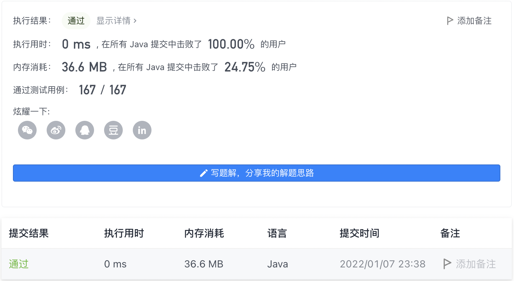

#### 1614. 括号的最大嵌套深度

#### 2022-01-07 LeetCode每日一题

链接：https://leetcode-cn.com/problems/maximum-nesting-depth-of-the-parentheses/

标签：**字符串**

> 题目

如果字符串满足以下条件之一，则可以称之为 有效括号字符串（valid parentheses string，可以简写为 VPS）：

- 字符串是一个空字符串 ""，或者是一个不为 "(" 或 ")" 的单字符。
- 字符串可以写为 AB（A 与 B 字符串连接），其中 A 和 B 都是 有效括号字符串 。
- 字符串可以写为 (A)，其中 A 是一个 有效括号字符串 。

类似地，可以定义任何有效括号字符串 S 的 嵌套深度 depth(S)：

- depth("") = 0
- depth(C) = 0，其中 C 是单个字符的字符串，且该字符不是 "(" 或者 ")"
- depth(A + B) = max(depth(A), depth(B))，其中 A 和 B 都是 有效括号字符串
- depth("(" + A + ")") = 1 + depth(A)，其中 A 是一个 有效括号字符串

例如：""、"()()"、"()(()())" 都是 有效括号字符串（嵌套深度分别为 0、1、2），而 ")(" 、"(()" 都不是 有效括号字符串 。

给你一个 有效括号字符串 s，返回该字符串的 s 嵌套深度 。

示例 1：

```java
输入：s = "(1+(2*3)+((8)/4))+1"
输出：3
解释：数字 8 在嵌套的 3 层括号中。
```

示例 2：

```java
输入：s = "(1)+((2))+(((3)))"
输出：3
```

示例 3：

```java
输入：s = "1+(2*3)/(2-1)"
输出：1
```

示例 4：

```java
输入：s = "1"
输出：0
```


提示：

- 1 <= s.length <= 100
- s 由数字 0-9 和字符 '+'、'-'、'*'、'/'、'('、')' 组成
- 题目数据保证括号表达式 s 是 有效的括号表达式

> 分析

统计字符串中左括号出现的次数，并不断更新最大出现次数，同时出现右括号时和左括号进行抵消。

> 编码

```java
class Solution {
    public int maxDepth(String s) {
        int max = 0, count = 0;
        char[] chs = s.toCharArray();

        for (int i = 0; i < chs.length; i++) {
            if (chs[i] == '(') {
                count++;
                max = Math.max(count, max);
            } else if (chs[i] == ')') {
                count--;
            }
        }

        return max;
    }
}
```

