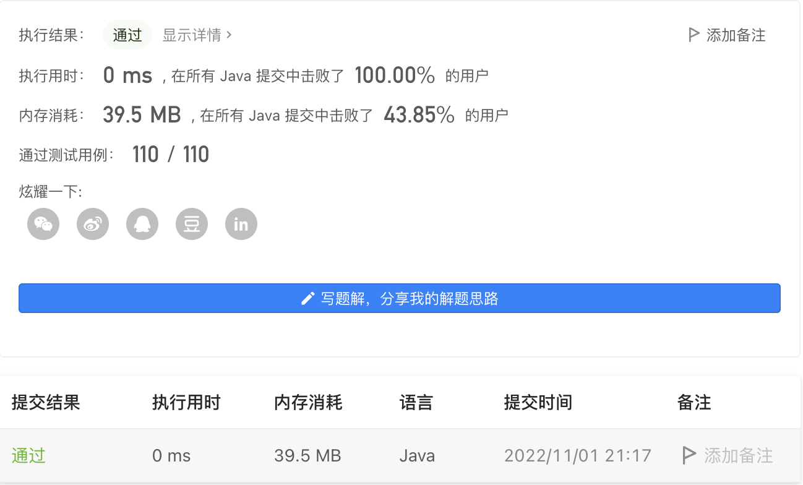

#### 1662. 检查两个字符串数组是否相等

#### 2022-11-01 LeetCode每日一题

链接：https://leetcode.cn/problems/check-if-two-string-arrays-are-equivalent/

标签：**数组、字符串**

> 题目

给你两个字符串数组 word1 和 word2 。如果两个数组表示的字符串相同，返回 true ；否则，返回 false 。

数组表示的字符串 是由数组中的所有元素 按顺序 连接形成的字符串。

示例 1：

```java
输入：word1 = ["ab", "c"], word2 = ["a", "bc"]
输出：true
解释：
word1 表示的字符串为 "ab" + "c" -> "abc"
word2 表示的字符串为 "a" + "bc" -> "abc"
两个字符串相同，返回 true
```

示例 2：

```java
输入：word1 = ["a", "cb"], word2 = ["ab", "c"]
输出：false
```

示例 3：

```java
输入：word1  = ["abc", "d", "defg"], word2 = ["abcddefg"]
输出：true
```


提示：

- 1 <= word1.length, word2.length <= 10 ^ 3
- 1 <= word1[i].length, word2[i].length <= 10 ^ 3
- 1 <= sum(word1[i].length), sum(word2[i].length) <= 10 ^ 3
- word1[i] 和 word2[i] 由小写字母组成
    

> 编码

```java
class Solution {
    public boolean arrayStringsAreEqual(String[] word1, String[] word2) {
        StringBuilder sb1 = new StringBuilder();
        StringBuilder sb2 = new StringBuilder();
        for (String str : word1) {
            sb1.append(str);
        }
        for (String str : word2) {
            sb2.append(str);
        }
        return sb1.toString().equals(sb2.toString());
    }
}
```

