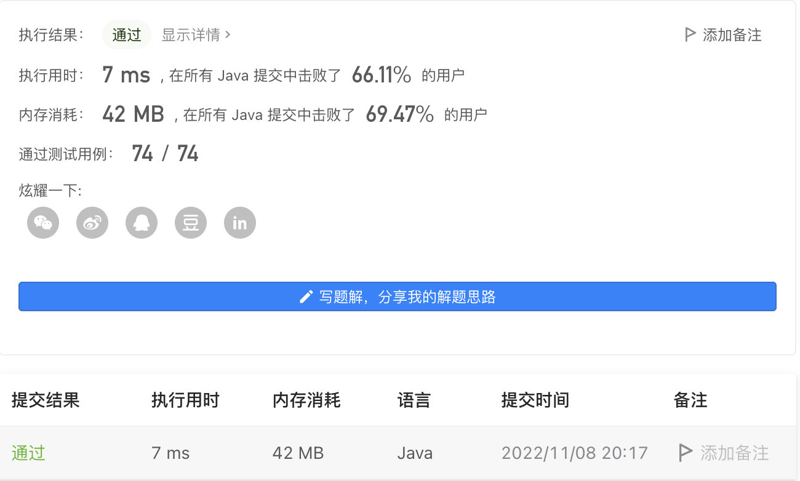
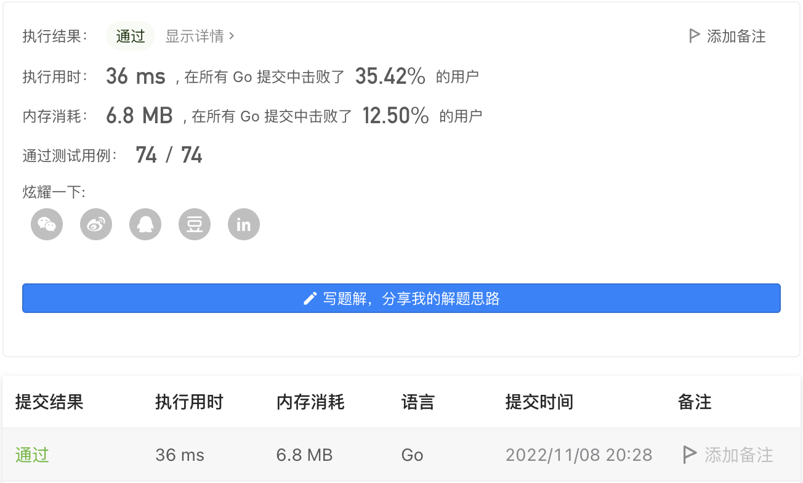

#### 1684. 统计一致字符串的数目

#### 2022-11-08 LeetCode每日一题

链接：https://leetcode.cn/problems/count-the-number-of-consistent-strings/

标签：**字符串、数组、哈希表**

> 题目

给你一个由不同字符组成的字符串 allowed 和一个字符串数组 words 。如果一个字符串的每一个字符都在 allowed 中，就称这个字符串是 一致字符串 。

请你返回 words 数组中 一致字符串 的数目。

示例 1：

```java
输入：allowed = "ab", words = ["ad","bd","aaab","baa","badab"]
输出：2
解释：字符串 "aaab" 和 "baa" 都是一致字符串，因为它们只包含字符 'a' 和 'b' 。
```

示例 2：

```java
输入：allowed = "abc", words = ["a","b","c","ab","ac","bc","abc"]
输出：7
解释：所有字符串都是一致的。
```

示例 3：

```java
输入：allowed = "cad", words = ["cc","acd","b","ba","bac","bad","ac","d"]
输出：4
解释：字符串 "cc"，"acd"，"ac" 和 "d" 是一致字符串。
```


提示：

- 1 <= words.length <= 10 ^ 4
- 1 <= allowed.length <= 26
- 1 <= words[i].length <= 10
- allowed 中的字符 互不相同 。
- words[i] 和 allowed 只包含小写英文字母。

> 分析

可以使用长度为26的数组记录allowed字符串中哪些字母出现过，然后查找一致字符串即可。

> 编码

```java
class Solution {
    public int countConsistentStrings(String allowed, String[] words) {
        boolean[] arr = new boolean[26];
        for (int i = 0; i < allowed.length(); i++) {
            arr[allowed.charAt(i) - 'a'] = true;
        }

        int ans = 0;
        for (String str : words) {
            char[] chs = str.toCharArray();
            boolean flag = true;
            for (char c : chs) {
                if (!arr[c - 'a']) {
                    flag = false;
                    break;
                }
            }
            if (flag) {
                ans++;
            }
        }

        return ans;
    }
}
```



```go
func countConsistentStrings(allowed string, words []string) int {
    arr := make([]bool, 26)
    for _, c := range allowed {
        arr[c - 'a'] = true
    }
    count := 0
    for _, word := range words {
        flag := true
        for _, w := range word {
            if !arr[w - 'a'] {
                flag = false
                break
            }
        }
        if flag {
            count++
        }
    }
    return count
}
```

