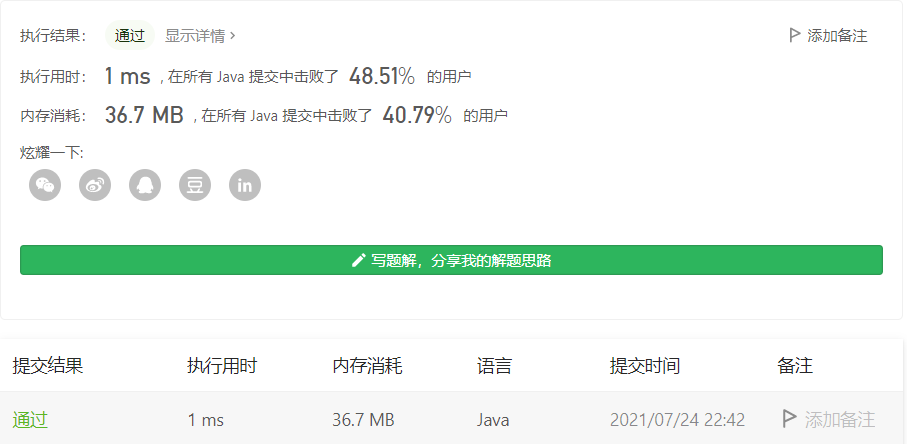

#### 1736. 替换隐藏数字得到的最晚时间

#### 2021-07-24 LeetCode每日一题

链接：https://leetcode-cn.com/problems/latest-time-by-replacing-hidden-digits/

标签：**字符串**

> 题目

给你一个字符串 time ，格式为 hh:mm（小时：分钟），其中某几位数字被隐藏（用 ? 表示）。

有效的时间为 00:00 到 23:59 之间的所有时间，包括 00:00 和 23:59 。

替换 time 中隐藏的数字，返回你可以得到的最晚有效时间。

示例 1：

```java
输入：time = "2?:?0"
输出："23:50"
解释：以数字 '2' 开头的最晚一小时是 23 ，以 '0' 结尾的最晚一分钟是 50 。
```

示例 2：

```java
输入：time = "0?:3?"
输出："09:39"
```

示例 3：

```java
输入：time = "1?:22"
输出："19:22"
```


提示：

- time 的格式为 hh:mm
- 题目数据保证你可以由输入的字符串生成有效的时间

> 分析

注意前两位有范围。00 - 23，第一位范围[0, 2]，并且受到第二位的影响，如果第二位 >= 4，那么第一位只能取0或者1，不然就会出现24,25这样的时间了。而第二位受第一位的影响，如果第一位取的是2，那么第二位只能取[0, 3]。

> 编码

```java
class Solution {
    public String maximumTime(String time) {
        StringBuilder sb = new StringBuilder();
        char[] chs = time.toCharArray();
        
        // 前两位相互制约
        if (chs[0] == '?') {
            if (chs[1] != '?' && chs[1] - '0' >= 4) {
                sb.append("1");
            } else {
                sb.append("2");
            }
        } else {
            sb.append(chs[0]);
        }

        if (chs[1] == '?') {
            if (chs[0] == '2' || chs[0] == '?') {
                sb.append("3");
            } else {
                sb.append("9");
            }
        } else {
            sb.append(chs[1]);
        }

        sb.append(chs[2]);
        sb.append(chs[3] == '?' ? "5" : chs[3]);
        sb.append(chs[4] == '?' ? "9" : chs[4]);
        return sb.toString();
    }
}
```

