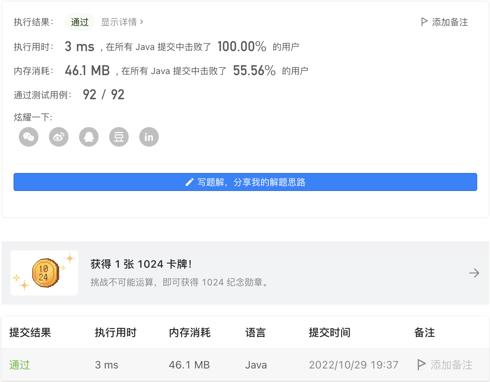
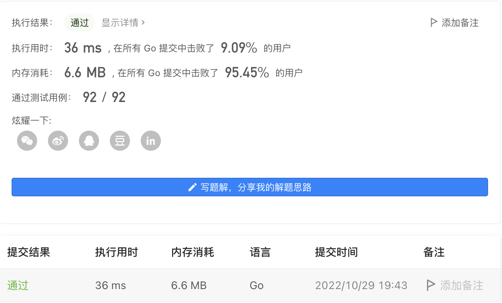

#### 1773. 统计匹配检索规则的物品数量

#### 2022-10-29 LeetCode每日一题

链接：https://leetcode.cn/problems/count-items-matching-a-rule/

标签：**数组、字符串**

> 题目

给你一个数组 items ，其中 items[i] = [typei, colori, namei] ，描述第 i 件物品的类型、颜色以及名称。

另给你一条由两个字符串 ruleKey 和 ruleValue 表示的检索规则。

如果第 i 件物品能满足下述条件之一，则认为该物品与给定的检索规则 匹配 ：

- ruleKey == "type" 且 ruleValue == typei 。
- ruleKey == "color" 且 ruleValue == colori 。
- ruleKey == "name" 且 ruleValue == namei 。

统计并返回 匹配检索规则的物品数量 。

示例 1：

```java
输入：items = [["phone","blue","pixel"],["computer","silver","lenovo"],["phone","gold","iphone"]], ruleKey = "color", ruleValue = "silver"
输出：1
解释：只有一件物品匹配检索规则，这件物品是 ["computer","silver","lenovo"] 。
```

示例 2：

```java
输入：items = [["phone","blue","pixel"],["computer","silver","phone"],["phone","gold","iphone"]], ruleKey = "type", ruleValue = "phone"
输出：2
解释：只有两件物品匹配检索规则，这两件物品分别是 ["phone","blue","pixel"] 和 ["phone","gold","iphone"] 。注意，["computer","silver","phone"] 未匹配检索规则。
```


提示：

- 1 <= items.length <= 10 ^ 4
- 1 <= typei.length, colori.length, namei.length, ruleValue.length <= 10
- ruleKey 等于 "type"、"color" 或 "name"
- 所有字符串仅由小写字母组成

> 分析

通过ruleKey判断ruleValue是描述物品的什么特征，然后判断特征是否匹配即可。

> 编码

```java
class Solution {
    public int countMatches(List<List<String>> items, String ruleKey, String ruleValue) {
        int count = 0, index = 0;
        if (ruleKey.equals("color")) {
            index = 1;
        } else if (ruleKey.equals("name")) {
            index = 2;
        }

        for (List<String> list : items) {
            if (ruleValue.equals(list.get(index))) {
                count++;
            }
        }
        return count;
    }
}
```



```GO
var d = map[string]int{"type": 0, "color": 1, "name": 2}
func countMatches(items [][]string, ruleKey string, ruleValue string) int {
    index := d[ruleKey]
    ans := 0
    for _, item := range items {
        if item[index] == ruleValue {
            ans++
        }
    }
    return ans
}
```

