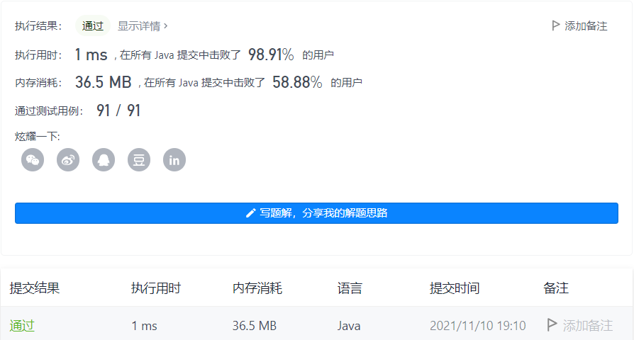

#### 20. 有效的括号

链接：https://leetcode-cn.com/problems/valid-parentheses/

标签：**栈、字符串**

> 题目

给定一个只包括 '('，')'，'{'，'}'，'['，']' 的字符串 s ，判断字符串是否有效。

有效字符串需满足：

- 左括号必须用相同类型的右括号闭合。
- 左括号必须以正确的顺序闭合。


示例 1：

```java
输入：s = "()"
输出：true
```

示例 2：

```java
输入：s = "()[]{}"
输出：true
```

示例 3：

```java
输入：s = "(]"
输出：false
```

示例 4：

```java
输入：s = "([)]"
输出：false
```

示例 5：

```java
输入：s = "{[]}"
输出：true
```


提示：

- 1 <= s.length <= 10 ^ 4
- s 仅由括号 '()[]{}' 组成

> 分析

可以直接使用栈，栈的特点就是后进先出，所以在碰到左括号的时候就入栈，碰到右括号的时候，就把栈顶元素拿出来进行比较，如果相等则继续比较下一个，知道栈为空。注意在弹出栈顶元素之前需要先判断栈是不是空的，因为可能第一个就是右括号这种情况。

> 编码

```java
class Solution {
    public boolean isValid(String s) {
        // 长度必须为偶数
        if (s.length() % 2 != 0) {
            return false;
        }
        
        Deque<Character> deque = new ArrayDeque<>();
        for (char c : s.toCharArray()) {
            if (c == '(' || c == '{' || c == '[') {
                deque.push(c);
            } else {
                if (deque.isEmpty()) {
                    return false;
                }
                char temp = deque.pop();
                if ((c == ')' && temp != '(') || (c == '}' && temp != '{') || (c == ']' && temp != '[')){
                    return false;
                }
            }
        }

        return deque.isEmpty();
    }
}
```

