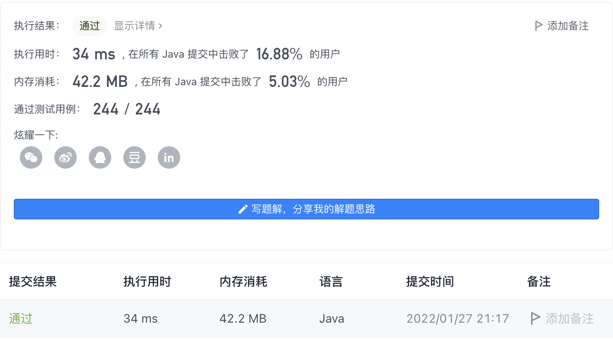

#### 2047. 句子中的有效单词数

#### 2022-01-27 LeetCode每日一题

链接：https://leetcode-cn.com/problems/number-of-valid-words-in-a-sentence/

标签：**字符串**

> 题目

句子仅由小写字母（'a' 到 'z'）、数字（'0' 到 '9'）、连字符（'-'）、标点符号（'!'、'.' 和 ','）以及空格（' '）组成。每个句子可以根据空格分解成 一个或者多个 token ，这些 token 之间由一个或者多个空格 ' ' 分隔。

如果一个 token 同时满足下述条件，则认为这个 token 是一个有效单词：

- 仅由小写字母、连字符和/或标点（不含数字）。
- 至多一个 连字符 '-' 。如果存在，连字符两侧应当都存在小写字母（"a-b" 是一个有效单词，但 "-ab" 和 "ab-" 不是有效单词）。
- 至多一个 标点符号。如果存在，标点符号应当位于 token 的 末尾 。

这里给出几个有效单词的例子："a-b."、"afad"、"ba-c"、"a!" 和 "!" 。

给你一个字符串 sentence ，请你找出并返回 sentence 中 有效单词的数目 。 

示例 1：

```java
输入：sentence = "cat and  dog"
输出：3
解释：句子中的有效单词是 "cat"、"and" 和 "dog"
```

示例 2：

```java
输入：sentence = "!this  1-s b8d!"
输出：0
解释：句子中没有有效单词
"!this" 不是有效单词，因为它以一个标点开头
"1-s" 和 "b8d" 也不是有效单词，因为它们都包含数字
```

示例 3：

```java
输入：sentence = "alice and  bob are playing stone-game10"
输出：5
解释：句子中的有效单词是 "alice"、"and"、"bob"、"are" 和 "playing"
"stone-game10" 不是有效单词，因为它含有数字
```

示例 4：

```java
输入：sentence = "he bought 2 pencils, 3 erasers, and 1  pencil-sharpener."
输出：6
解释：句子中的有效单词是 "he"、"bought"、"pencils,"、"erasers,"、"and" 和 "pencil-sharpener."
```


提示：

- 1 <= sentence.length <= 1000
- sentence 由小写英文字母、数字（0-9）、以及字符（' '、'-'、'!'、'.' 和 ','）组成
- 句子中至少有 1 个 token

> 分析

可以使用if按条件进行判断或者使用正则表达式匹配。

> 编码

```java
class Solution {
    public int countValidWords(String sentence) {
        String[] arr = sentence.split(" ");
        int ans = 0;

        for (String str : arr) {
            int len = str.trim().length();
            if (len == 0) {
                continue;
            }

            boolean flag = true;
            int count = 0;
            for (int i = 0; i < len; i++) {
                if (str.charAt(i) >= '0' && str.charAt(i) <= '9') {
                    flag = false;
                    break;
                }
                if ((str.charAt(i) == '!' || str.charAt(i) == '.' || str.charAt(i) == ',') && i != len - 1) {
                    flag = false;
                    break;
                }
                boolean temp = (count == 0 && (i - 1 >= 0 && str.charAt(i - 1) >= 'a' && str.charAt(i - 1) <= 'z') && (i + 1 < len && str.charAt(i + 1) >= 'a' && str.charAt(i + 1) <= 'z'));
                if (str.charAt(i) == '-') {
                    if (count != 0 || !temp) {
                        flag = false;
                        break;
                    }
                }
                if (str.charAt(i) == '-' && temp) {
                    count++;
                }
            }

            if (flag) {
                ans++;
            }
        }

        return ans;
    }
}
```


```java
class Solution {
    public int countValidWords(String sentence) {
        String reg = "([a-z]*|([a-z]+-[a-z]+))[!,.]?";
        int ans = 0;
        for (String str : sentence.split(" ")) {
            if (str.length() > 0 && str.matches(reg)) {
                ans++;
            }
        }

        return ans;
    }
}
```

