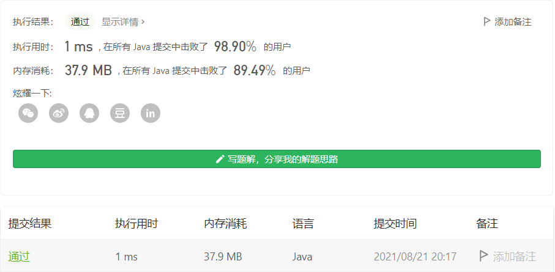

#### 443. 压缩字符串

#### 2021-08-21 LeetCode每日一题

链接：https://leetcode-cn.com/problems/string-compression/

标签：**字符串、双指针**

> 题目

给你一个字符数组 chars ，请使用下述算法压缩：

从一个空字符串 s 开始。对于 chars 中的每组 连续重复字符 ：

- 如果这一组长度为 1 ，则将字符追加到 s 中。
- 否则，需要向 s 追加字符，后跟这一组的长度。

压缩后得到的字符串 s 不应该直接返回 ，需要转储到字符数组 chars 中。需要注意的是，如果组长度为 10 或 10 以上，则在 chars 数组中会被拆分为多个字符。

请在 修改完输入数组后 ，返回该数组的新长度。

你必须设计并实现一个只使用常量额外空间的算法来解决此问题。

示例 1：

```java
输入：chars = ["a","a","b","b","c","c","c"]
输出：返回 6 ，输入数组的前 6 个字符应该是：["a","2","b","2","c","3"]
解释：
"aa" 被 "a2" 替代。"bb" 被 "b2" 替代。"ccc" 被 "c3" 替代。
```

示例 2：

```java
输入：chars = ["a"]
输出：返回 1 ，输入数组的前 1 个字符应该是：["a"]
解释：
没有任何字符串被替代。
```

示例 3：

```java
输入：chars = ["a","b","b","b","b","b","b","b","b","b","b","b","b"]
输出：返回 4 ，输入数组的前 4 个字符应该是：["a","b","1","2"]。
解释：
由于字符 "a" 不重复，所以不会被压缩。"bbbbbbbbbbbb" 被 “b12” 替代。
注意每个数字在数组中都有它自己的位置。
```


提示：

- 1 <= chars.length <= 2000
- chars[i] 可以是小写英文字母、大写英文字母、数字或符号

> 分析

注意题目的要求，**要修改原字符串**，然后返回长度即可，长度后面的字符不需要管，因为会截取，只要保证长度内的字符正确就行了。

这个一般的遍历就行了。

> 编码

```java
class Solution {
    public int compress(char[] chars) {
        int count = 1, index = 1;
        char c = chars[0];
        for (int i = 1; i < chars.length; i++) {
            if (chars[i] == c) {
                count++;
            } else {
                if (count > 1) {
                    char[] temp = String.valueOf(count).toCharArray();
                    for (int j = 0; j < temp.length; j++) {
                        chars[index++] = temp[j];
                    }
                }
                count = 1;
                c = chars[i];
                chars[index++] = c;
            }
        }

        if (count > 1) {
            char[] temp = String.valueOf(count).toCharArray();
            for (int j = 0; j < temp.length; j++) {
                chars[index++] = temp[j];
            }
        }

        return index;
    }
}
```

