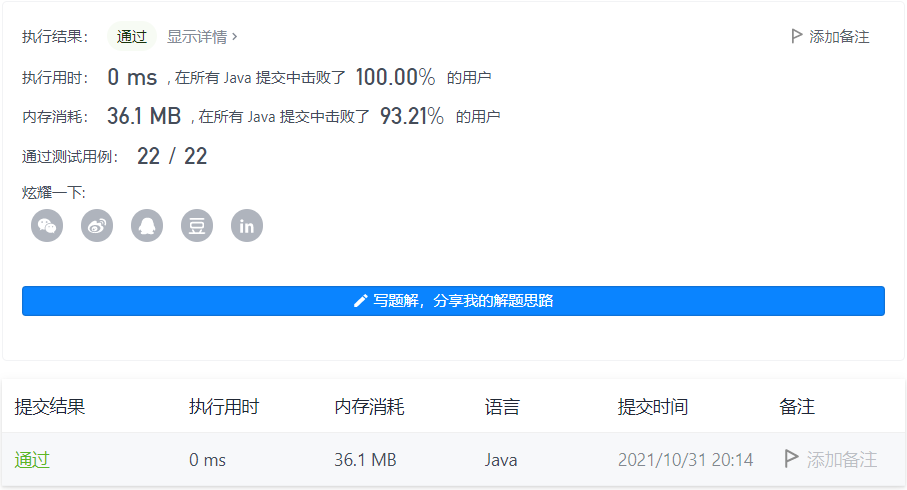

#### 500. 键盘行

#### 2021-10-31 LeetCode每日一题

链接：https://leetcode-cn.com/problems/keyboard-row/

标签：**字符串、哈希表**

> 题目

给你一个字符串数组 words ，只返回可以使用在 美式键盘 同一行的字母打印出来的单词。键盘如下图所示。

美式键盘 中：

- 第一行由字符 "qwertyuiop" 组成。
- 第二行由字符 "asdfghjkl" 组成。
- 第三行由字符 "zxcvbnm" 组成。


示例 1：

```java
输入：words = ["Hello","Alaska","Dad","Peace"]
输出：["Alaska","Dad"]
```

示例 2：

```java
输入：words = ["omk"]
输出：[]
```

示例 3：

```java
输入：words = ["adsdf","sfd"]
输出：["adsdf","sfd"]
```


提示：

- 1 <= words.length <= 20
- 1 <= words[i].length <= 100
- words[i] 由英文字母（小写和大写字母）组成

> 分析

因为给定的字符串包含大小写，所以可以都转换为小写后进行操作。然后挨个字符判断是不是在某一行即可。

> 编码

```java
class Solution {
    public String[] findWords(String[] words) {
        StringBuilder sb = new StringBuilder();
        String[] s = new String[]{"qwertyuiop", "asdfghjkl", "zxcvbnm"};
        for (String str : words) {
            String t = null;
            // 转为小写
            char[] chs = str.toLowerCase().toCharArray();
            // 判断第一个字符在哪行
            if (s[0].indexOf(chs[0]) != -1) {
                t = s[0];
            } else if (s[1].indexOf(chs[0]) != -1) {
                t = s[1];
            } else {
                t = s[2];
            }

            int i;
            for (i = 1; i < chs.length; i++) {
                // 其他字符是否和第一个字符在同一行，如果不是直接break
                if (t.indexOf(chs[i]) == -1) {
                    break;
                }
            }
            if (i == chs.length) {
                sb.append(str).append(",");
            }
        }
        // sb如果长度为0，直接split答案是[""]，需要处理
        return sb.length() == 0 ? sb.append(",").toString().split(",") : sb.toString().split(",");
    }
}
```

