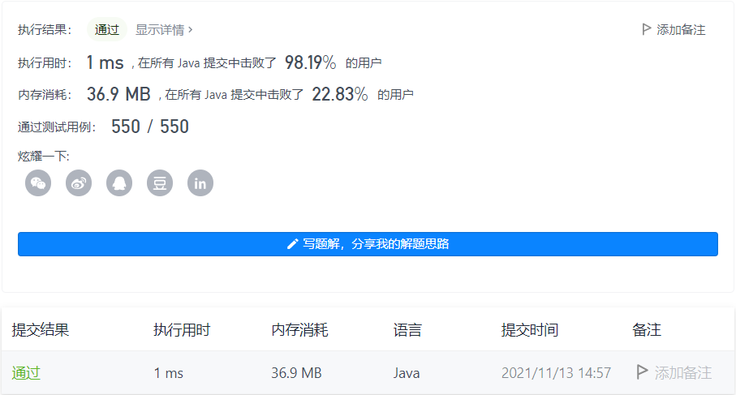

#### 520. 检测大写字母

#### 2021-11-13 LeetCode每日一题

链接：https://leetcode-cn.com/problems/detect-capital/

标签：**字符串**

> 题目

我们定义，在以下情况时，单词的大写用法是正确的：

- 全部字母都是大写，比如 "USA" 。
- 单词中所有字母都不是大写，比如 "leetcode" 。
- 如果单词不只含有一个字母，只有首字母大写， 比如 "Google" 。

给你一个字符串 word 。如果大写用法正确，返回 true ；否则，返回 false 。

示例 1：

```java
输入：word = "USA"
输出：true
```

示例 2：

```java
输入：word = "FlaG"
输出：false
```


提示：

- 1 <= word.length <= 100
- word 由小写和大写英文字母组成

> 分析

对于一个字符串，我们先判断它的首字母是大写还是小写，如果是大写，则

- 首字母后面的都是小写
- 首字母后面的都是大写

如果首字母是小写，那么首字母后面的都是小写才是正确的。所以我们判断首字母后，再统计一下首字母后面有几个小写字母，再依据小写字母的数量判断是不是正确的单词即可。

> 编码

```java
class Solution {
    public boolean detectCapitalUse(String word) {
        boolean flag = false;
        if (word.charAt(0) >= 'A' && word.charAt(0) <= 'Z') {
            flag = true;
        }

        int count = 0;
        for (char c : word.toCharArray()) {
            if (c >= 'a' && c <= 'z') {
                count++;
            }
        }

        // 1、首字母大写并且后面的字母都是大写
        // 2、首字母大写并且后面的字母都是小写
        // 3、所有的字母都是小写
        if ((flag && (count == 0 || count == word.length() - 1)) || count == word.length()) {
            return true;
        }

        return false;
    }
}
```

