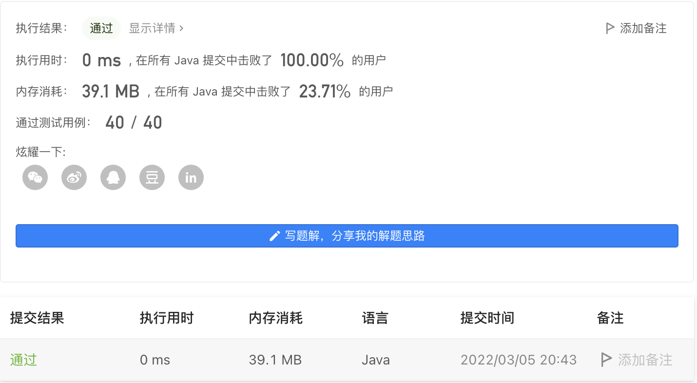
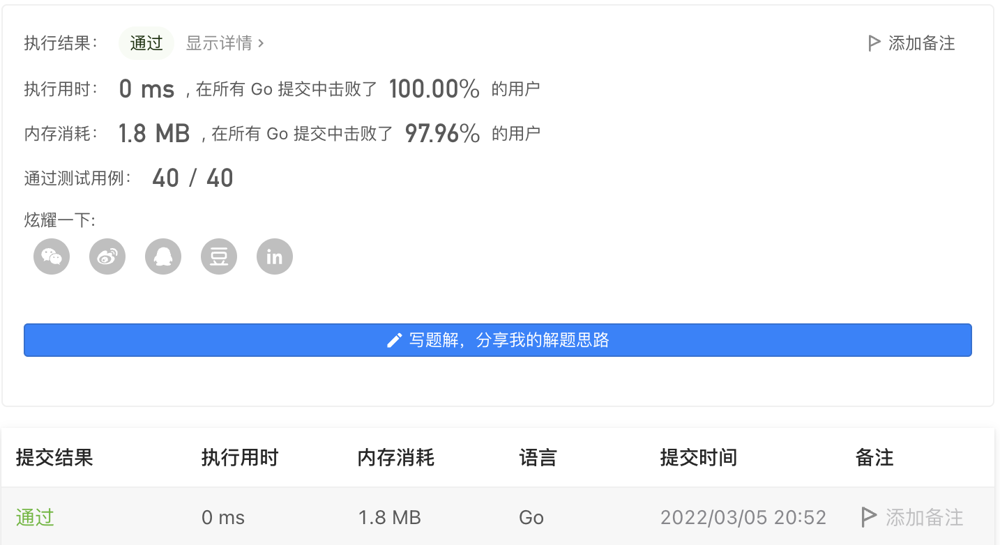

#### 521. 最长特殊序列 Ⅰ

#### 2022-03-05 LeetCode每日一题

链接：https://leetcode-cn.com/problems/longest-uncommon-subsequence-i/

标签：**字符串**

> 题目

给你两个字符串 a 和 b，请返回 这两个字符串中 最长的特殊序列  的长度。如果不存在，则返回 -1 。

「最长特殊序列」 定义如下：该序列为 某字符串独有的最长子序列（即不能是其他字符串的子序列） 。

字符串 s 的子序列是在从 s 中删除任意数量的字符后可以获得的字符串。

- 例如，"abc" 是 "aebdc" 的子序列，因为删除 "aebdc" 中斜体加粗的字符可以得到 "abc" 。 "aebdc" 的子序列还包括 "aebdc" 、 "aeb" 和 "" (空字符串)。


示例 1：

```java
输入: a = "aba", b = "cdc"
输出: 3
解释: 最长特殊序列可为 "aba" (或 "cdc")，两者均为自身的子序列且不是对方的子序列。
```

示例 2：

```java
输入：a = "aaa", b = "bbb"
输出：3
解释: 最长特殊序列是 "aaa" 和 "bbb" 。
```

示例 3：

```java
输入：a = "aaa", b = "aaa"
输出：-1
解释: 字符串 a 的每个子序列也是字符串 b 的每个子序列。同样，字符串 b 的每个子序列也是字符串 a 的子序列。
```


提示：

- 1 <= a.length, b.length <= 100
- a 和 b 由小写英文字母组成

> 分析

仔细思考一下，发现只要两个字符串不相等，那么长度更长的那个就是「最长特殊序列」，如果两个字符串相等，那么返回-1.

> 编码

```java
class Solution {
    public int findLUSlength(String a, String b) {
        if (a.equals(b)) {
            return -1;
        }
        return a.length() > b.length() ? a.length() : b.length();
    }
}
```



```go
func findLUSlength(a string, b string) int {
    if a == b {
        return -1
    } else if len(a) > len(b) {
        return len(a)
    } else {
        return len(b)
    }
}
```

