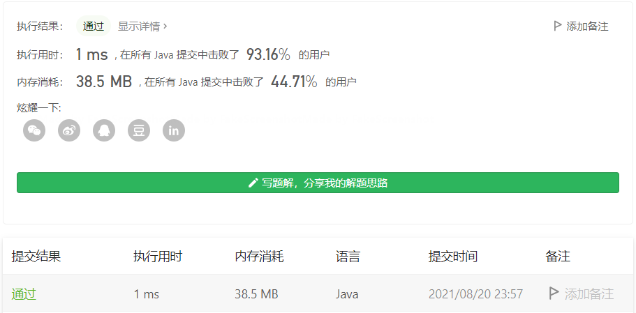

#### 541. 反转字符串 II

#### 2021-08-20 LeetCode每日一题

链接：https://leetcode-cn.com/problems/reverse-string-ii/

标签：**字符串、双指针**

> 题目

给定一个字符串 s 和一个整数 k，从字符串开头算起，每 2k 个字符反转前 k 个字符。

- 如果剩余字符少于 k 个，则将剩余字符全部反转。
- 如果剩余字符小于 2k 但大于或等于 k 个，则反转前 k 个字符，其余字符保持原样。


示例 1：

```java
输入：s = "abcdefg", k = 2
输出："bacdfeg"
```

示例 2：

```java
输入：s = "abcd", k = 2
输出："bacd"
```


提示：

- 1 <= s.length <= 104
- s 仅由小写英文组成
- 1 <= k <= 104

> 分析

每次加k遍历循环即可，只需要注意循环完后，需要判断剩下的字符属于2k中的前k个还是后k个，如果是前k个，则全部反转，否则不反转。

> 编码

```java
class Solution {
    public String reverseStr(String s, int k) {
        if (k >= s.length()) {
            return new StringBuilder(s).reverse().toString();
        }
        StringBuilder sb = new StringBuilder();
        int count = 0, len = s.length(), i = 0;
        for (i = k; i < len; i += k) {
            StringBuilder temp = new StringBuilder(s.substring(i - k, i));
            if (count % 2 == 0) {
                sb.append(temp.reverse().toString());
            } else {
                sb.append(temp.toString());
            }
            count++;
        }

        // 拼接剩余的字符
        if (count % 2 != 0) {
            sb.append(s.substring(i - k));
        } else {
            sb.append(new StringBuilder(s.substring(i - k)).reverse().toString());
        }
        
        return sb.toString();
    }
}
```

