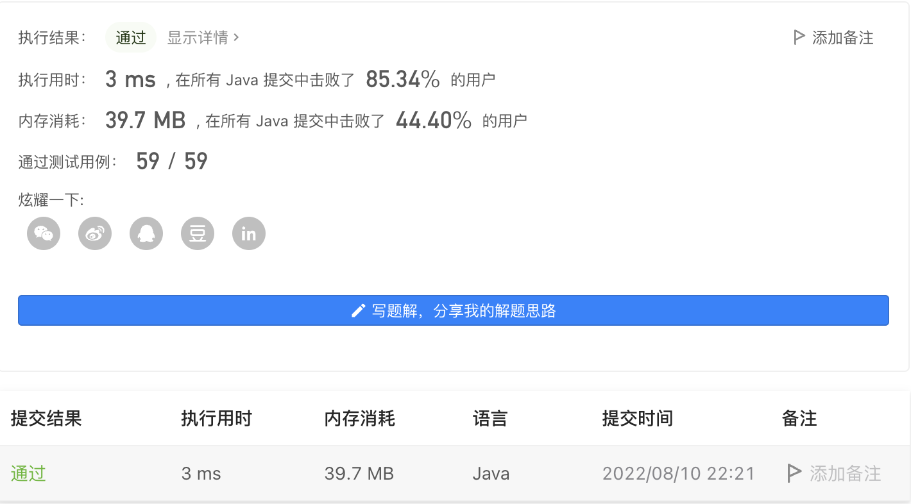

#### 640. 求解方程

#### 2022-08-10 LeetCode每日一题

链接：https://leetcode.cn/problems/solve-the-equation/

标签：**字符串、数学、模拟**

> 题目

求解一个给定的方程，将x以字符串 "x=#value" 的形式返回。该方程仅包含 '+' ， '-' 操作，变量 x 和其对应系数。

如果方程没有解，请返回 "No solution" 。如果方程有无限解，则返回 “Infinite solutions” 。

题目保证，如果方程中只有一个解，则 'x' 的值是一个整数。

示例 1：

```java
输入: equation = "x+5-3+x=6+x-2"
输出: "x=2"
```

示例 2:

```java
输入: equation = "x=x"
输出: "Infinite solutions"
```

示例 3:

```java
输入: equation = "2x=x"
输出: "x=0"
```


提示:

- 3 <= equation.length <= 1000
- equation 只有一个 '='.
- equation 方程由整数组成，其绝对值在 [0, 100] 范围内，不含前导零和变量 'x' 。 

> 分析

用x表示系数，num表示值，op表示当前正负号，遍历表达式，当下标为i时，对于的字符为c：

- 当c == '+'时，op = 1，移动到下一位。
- 当c == '-'时，op = -1，移动到下一位。
- 当c == '='时，x = -x，num = -num，op = 1。相当于把表达式左边移动到等号右边。
- 剩下的情况下，从下标i开始移动，直到遇到下一个'+', '-', '='符号，假设此时下标为j
  - 如果j - 1对应的字符为'x'，判断i == j - 1，如果成立，则x += op，如果不成立，则x += num(i, j - 2) * op。num(i, j - 2)表示把下标[i, j - 2]转换为整数。
  - 如果j - 1对应的字符不为'x'，则num += num(i, j - 1) * op。
  - 把j的值赋值给i。

遍历完成后，判断x的值

- 如果x == 0 & num == 0，则说明有无穷个解。
- 如果x == 0 & num != 0，则说明无解。
- 如果x != 0，则解为num / -x

> 编码

```java
class Solution {
    public String solveEquation(String equation) {
        // x表示系数，num表示值
        int x = 0, num = 0, len = equation.length();
        char[] chs = equation.toCharArray();
        for (int i = 0, op = 1; i < len; ) {
            if (chs[i] == '+') {
                op = 1;
                i++;
            } else if (chs[i] == '-') {
                op = -1;
                i++;
            } else if (chs[i] == '=') {
                // 相当于把等号左边的数移到等号右边
                x *= -1;
                num *= -1;
                op = 1;
                i++;
            } else {
                int j = i;
                while (j < len && chs[j] != '+' && chs[j] != '-' && chs[j] != '=') {
                    j++;
                }
                if (chs[j - 1] == 'x') {
                    if (i == j - 1) {
                        x += op;
                    } else {
                        x += (Integer.parseInt(equation.substring(i, j - 1)) * op);
                    }
                } else {
                    num += (Integer.parseInt(equation.substring(i, j)) * op);
                }
                i = j;
            }
        }

        if (x == 0) {
            return num == 0 ? "Infinite solutions" : "No solution";
        }
        return "x=" + (num / -x);
    }
}
```

