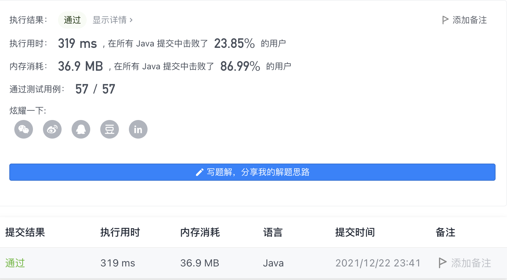

#### 686. 重复叠加字符串匹配

#### 2021-12-22 LeetCode每日一题

链接：https://leetcode-cn.com/problems/repeated-string-match/

标签：**字符串、字符串匹配**

> 题目

给定两个字符串 a 和 b，寻找重复叠加字符串 a 的最小次数，使得字符串 b 成为叠加后的字符串 a 的子串，如果不存在则返回 -1。

注意：字符串 "abc" 重复叠加 0 次是 ""，重复叠加 1 次是 "abc"，重复叠加 2 次是 "abcabc"。 

示例 1：

```java
输入：a = "abcd", b = "cdabcdab"
输出：3
解释：a 重复叠加三遍后为 "abcdabcdabcd", 此时 b 是其子串。
```

示例 2：

```java
输入：a = "a", b = "aa"
输出：2
```

示例 3：

```java
输入：a = "a", b = "a"
输出：1
```

示例 4：

```java
输入：a = "abc", b = "wxyz"
输出：-1
```


提示：

- 1 <= a.length <= 10 ^ 4
- 1 <= b.length <= 10 ^ 4
- a 和 b 由小写英文字母组成

> 分析

按理来说，一直重复叠加下去，如果b是a的子串，那么肯定可以匹配上。如果b不是a的子串，那最多需要重复几次呢？

- 如果a的长度 >= b的长度，那么最多需要重复两次就足够了。比如a = "xyz"，b = "xyz"，此时只需要重复一次；a = "xyz"，b = "zx"，此时就需要重复两次了。
- 如果a的长度 < b的长度，那么最多需要重复len(b) / len(a) + 2次即可。其中len(b) / len(a)代表B串中间A重复的次数，“+2”代表的首尾各添加一个A串。

> 编码

```java
class Solution {
    public int repeatedStringMatch(String a, String b) {
        int ans = 0;
        StringBuilder sb = new StringBuilder("");
        int step = b.length() / a.length() + 2;
        while (ans <= step) {
            if (sb.indexOf(b) != -1) {
                return ans;
            }
            sb.append(a);
            ans++;
        }

        return -1;
    }
}
```

