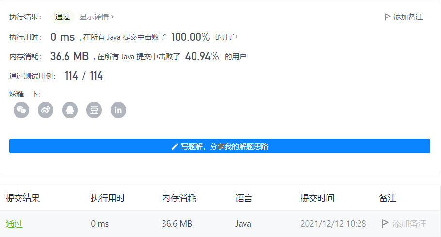
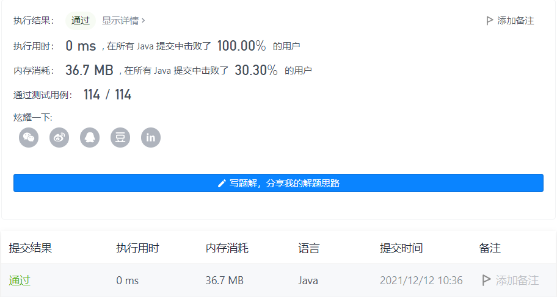

#### 709. 转换成小写字母

#### 2021-12-12 LeetCode每日一题

链接：https://leetcode-cn.com/problems/to-lower-case/

标签：**字符串**

> 题目

给你一个字符串 s ，将该字符串中的大写字母转换成相同的小写字母，返回新的字符串。

示例 1：

```java
输入：s = "Hello"
输出："hello"
```

示例 2：

```java
输入：s = "here"
输出："here"
```

示例 3：

```java
输入：s = "LOVELY"
输出："lovely"
```


提示：

- 1 <= s.length <= 100
- s 由 ASCII 字符集中的可打印字符组成

> 分析

解法1：直接调用相关的api。

解法2：根据ascii表，大写字母和小写字母相差32位，循环即可。

> 编码

解法1：

```java
class Solution {
    public String toLowerCase(String s) {
        return s.toLowerCase();
    }
}
```



解法2：

```java
class Solution {
    public String toLowerCase(String s) {
        char[] chs = s.toCharArray();
        for (int i = 0; i < chs.length; i++) {
            if (chs[i] >= 'A' && chs[i] <= 'Z') {
                chs[i] = (char)(chs[i] + 32);
            }
        }

        return String.valueOf(chs);
    }
}
```

