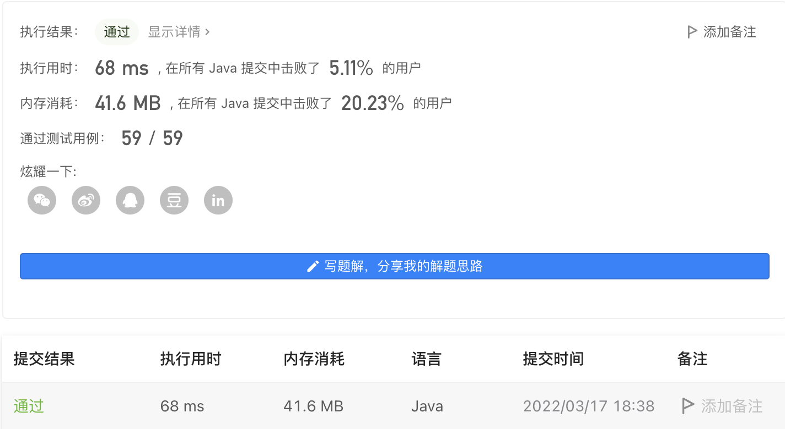

#### 720. 词典中最长的单词

#### 2022-03-17 LeetCode每日一题

链接：https://leetcode-cn.com/problems/longest-word-in-dictionary/

标签：**字符串、排序、数组、哈希表、字典树**

> 题目

给出一个字符串数组 words 组成的一本英语词典。返回 words 中最长的一个单词，该单词是由 words 词典中其他单词逐步添加一个字母组成。

若其中有多个可行的答案，则返回答案中字典序最小的单词。若无答案，则返回空字符串。

示例 1：

```java
输入：words = ["w","wo","wor","worl", "world"]
输出："world"
解释： 单词"world"可由"w", "wo", "wor", 和 "worl"逐步添加一个字母组成。
```

示例 2：

```java
输入：words = ["a", "banana", "app", "appl", "ap", "apply", "apple"]
输出："apple"
解释："apply" 和 "apple" 都能由词典中的单词组成。但是 "apple" 的字典序小于 "apply" 
```


提示：

- 1 <= words.length <= 1000
- 1 <= words[i].length <= 30
- 所有输入的字符串 words[i] 都只包含小写字母。

> 分析

首先明确题意，[该单词是由 words 词典中其他单词逐步添加一个字母组成]，有两个意思（1）需要从第一个单词开始逐步增加。比如world，要从w一直经过5个单词增加到world。（2）从词典中拿单词的时候，不需要考虑顺序问题。

明确了题意后，其实可以直接对词典按自然顺序排序，然后用一个list记录元素值，对当前元素去掉末尾一个字母后看看在list中是否存在，如果存在的情况下再和当前答案做长度比较（不用比较字典序了）。

> 编码

```java
class Solution {
    public String longestWord(String[] words) {
        // 按字典排序
        Arrays.sort(words);
        List<String> list = new ArrayList<>();
        String ans = "";

        for (String s : words) {
            // 添加一个字母
            if (s.length() == 1 || list.contains(s.substring(0, s.length() - 1))) {
                ans = s.length() >  ans.length() ? s : ans;
                list.add(s);
            }
        }

        return ans;
    }
}
```

