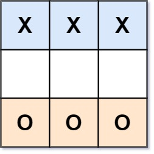
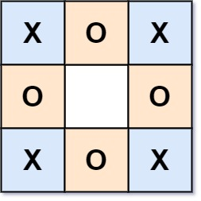

#### 794. 有效的井字游戏

#### 2021-12-09 LeetCode每日一题

链接：https://leetcode-cn.com/problems/valid-tic-tac-toe-state/

标签：**字符串、数组**

> 题目

给你一个字符串数组 board 表示井字游戏的棋盘。当且仅当在井字游戏过程中，棋盘有可能达到 board 所显示的状态时，才返回 true 。

井字游戏的棋盘是一个 3 x 3 数组，由字符 ' '，'X' 和 'O' 组成。字符 ' ' 代表一个空位。

以下是井字游戏的规则：

- 玩家轮流将字符放入空位（' '）中。
- 玩家 1 总是放字符 'X' ，而玩家 2 总是放字符 'O' 。
- 'X' 和 'O' 只允许放置在空位中，不允许对已放有字符的位置进行填充。
- 当有 3 个相同（且非空）的字符填充任何行、列或对角线时，游戏结束。
- 当所有位置非空时，也算为游戏结束。
- 如果游戏结束，玩家不允许再放置字符。

示例 1：


```java
输入：board = ["O  ","   ","   "]
输出：false
解释：玩家 1 总是放字符 "X" 。
```

示例 2：


```java
输入：board = ["XOX"," X ","   "]
输出：false
解释：玩家应该轮流放字符。
```

示例 3：



```java
输入：board = ["XXX","   ","OOO"]
输出：false
```

Example 4:



```java
输入：board = ["XOX","O O","XOX"]
输出：true
```


提示：

- board.length == 3
- board[i].length == 3
- board[i][j] 为 'X'、'O' 或 ' '

> 分析

玩家1放X，玩家2放O，两个人轮流放并且玩家1先放。所以当棋盘内X和O的数量满足下面关系时，棋盘才有可能达到 board 所显示的状态。

- O的数量不可能比X的数量更多。
- 当玩家1获胜时，X的数量肯定比O的数量多1。
- 当玩家2获胜时，O的数量肯定和X的数量一致。
- 玩家1和玩家2不可能同时获胜。即3个X和3个O不可能同时出现在一行或者一列或者对角线上。

> 编码

```java
class Solution {
    public boolean validTicTacToe(String[] board) {
        int count1 = 0, count2 = 0;
        char[][] chs = new char[3][3];
        // 统计X和O总共出现了几次
        for (int i = 0; i < 3; i++) {
            for (int j = 0; j < 3; j++) {
                if (board[i].charAt(j) == 'X') {
                    count1++;
                } else if (board[i].charAt(j) == 'O') {
                    count2++;
                }
                chs[i][j] = board[i].charAt(j);
            }
        }

        // 1、O的次数大于X，或者X比O的数量多1个以上，返回false
        if (count1 < count2 || count1 > count2 + 1) {
            return false;
        }
        boolean res1 = check(chs, 'X'), res2 = check(chs, 'O');
        // 2、玩家1胜利的情况下，X = O + 1
        if (res1 && count1 <= count2) {
            return false;
        }
        // 3、玩家2胜利的情况下，X = O
        if (res2 && count1 != count2) {
            return false;
        }
        // 不可能两个玩家都胜利
        if (res1 && res2) {
            return false;
        }
        return true;
    }

    private boolean check(char[][] chs, char c) {
        // 相同行或列都是相同字符时，返回true
        for (int i = 0; i < 3; i++) {
            if (chs[i][0] == c && chs[i][1] == c && chs[i][2] == c) {
                return true;
            }
            if (chs[0][i] == c && chs[1][i] == c && chs[2][i] == c) {
                return true;
            }
        }

        // 对角线出现相同字符时，返回true
        if (chs[0][0] == c && chs[1][1] == c && chs[2][2] == c) {
            return true;
        }
        if (chs[0][2] == c && chs[1][1] == c && chs[2][0] == c) {
            return true;
        }

        return false;  
    }
}
```

