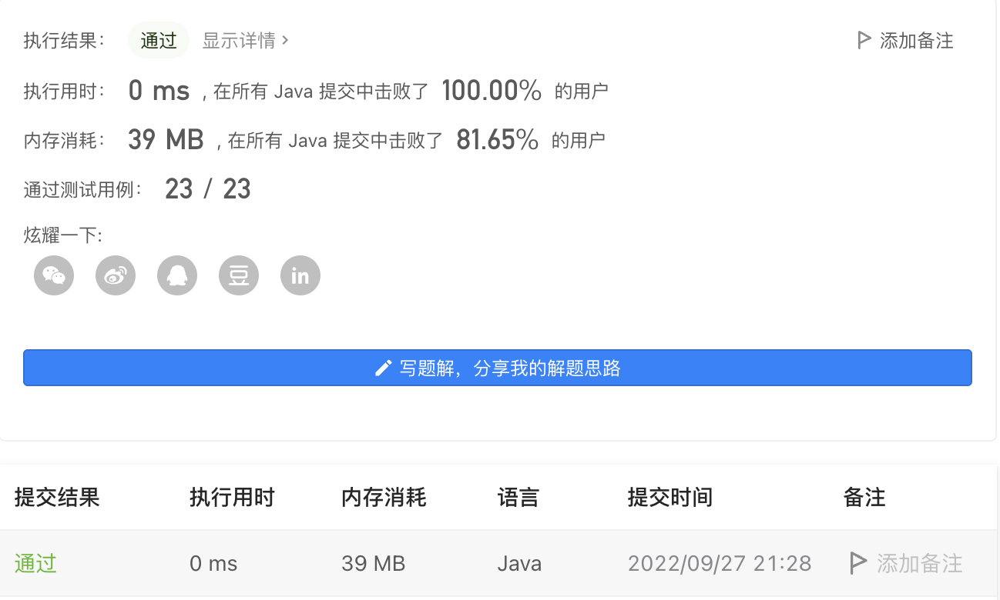
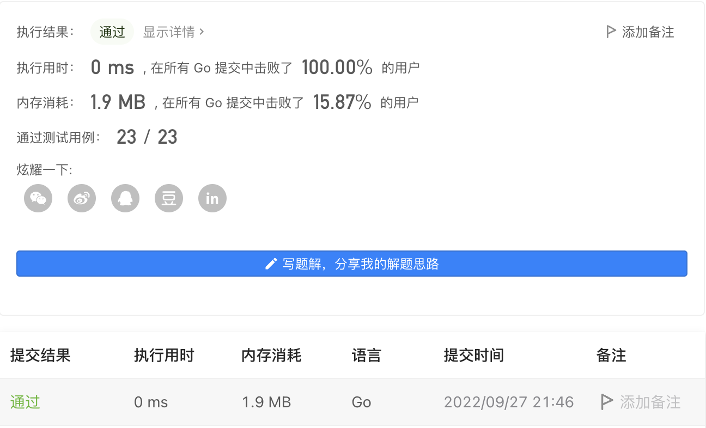

#### 面试题 01.02. 判定是否互为字符重排

#### 2022-09-27 LeetCode每日一题

链接：https://leetcode.cn/problems/check-permutation-lcci/

标签：**哈希表、字符串、排序**

> 题目

给定两个字符串 s1 和 s2，请编写一个程序，确定其中一个字符串的字符重新排列后，能否变成另一个字符串。

示例 1：

```java
输入: s1 = "abc", s2 = "bca"
输出: true 
```

示例 2：

```java
输入: s1 = "abc", s2 = "bad"
输出: false
```

说明：

- 0 <= len(s1) <= 100
- 0 <= len(s2) <= 100

> 分析

可以对字符串进行排序后，比较两个字符串是否相等。也可以记录s1中每个字符出现的次数，然后看看s2中字符的次数和s1的是否相等。

> 编码

```java
class Solution {
    public boolean CheckPermutation(String s1, String s2) {
        char[] ch1 = s1.toCharArray();
        char[] ch2 = s2.toCharArray();
        Arrays.sort(ch1);
        Arrays.sort(ch2);
        return new String(ch1).equals(new String(ch2));
    }
}
```



```go
func CheckPermutation(s1 string, s2 string) bool {
    b1, b2 := []byte(s1), []byte(s2)
	sort.Slice(b1, func(i, j int) bool {return b1[i] < b1[j]})
	sort.Slice(b2, func(i, j int) bool {return b2[i] < b2[j]})
	return string(b1) == string(b2)
}
```

