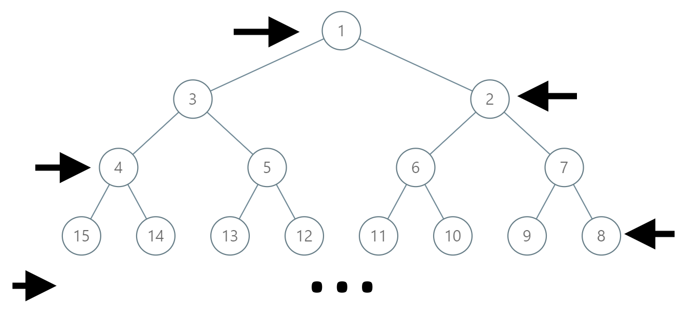

#### 1104. 二叉树寻路

#### 2021-07-29 LeetCode每日一题

链接：https://leetcode-cn.com/problems/path-in-zigzag-labelled-binary-tree/

标签：**二叉树、数学**

> 题目

在一棵无限的二叉树上，每个节点都有两个子节点，树中的节点 逐行 依次按 “之” 字形进行标记。

如下图所示，在奇数行（即，第一行、第三行、第五行……）中，按从左到右的顺序进行标记；

而偶数行（即，第二行、第四行、第六行……）中，按从右到左的顺序进行标记。



给你树上某一个节点的标号 label，请你返回从根节点到该标号为 label 节点的路径，该路径是由途经的节点标号所组成的。

示例 1：

```java
输入：label = 14
输出：[1,3,4,14]
```

示例 2：

```java
输入：label = 26
输出：[1,2,6,10,26]
```


提示：

- 1 <= label <= 10^6

> 分析

由题意我们可以求得某个数在该树的第几层。第h层有2 ^ (h - 1)个节点。对于一般的完全二叉树，节点值为label的节点，其父节点是的值为label / 2。但这里是“之”字形的二叉树，但通过找规律可知，对于节点值为label的节点，其父节点的值为`3 * 2 ^ (h - 2) - 1 - label / 2`。

> 编码

```java
class Solution {
    public List<Integer> pathInZigZagTree(int label) {
        int h = 0, temp = label;
        // 求label在第几层
        while (temp != 0) {
            h++;
            temp /= 2;
        }

        List<Integer> res = new ArrayList<>();
        res.add(label);
        while (h != 1) {
            label = 3 * (int)Math.pow(2, (h - 2)) - 1 - label / 2;
            res.add(label);
            h--;
        }

        return res.stream().sorted().collect(Collectors.toList());
    }
}
```


这击败率，各位真是神仙啊。。