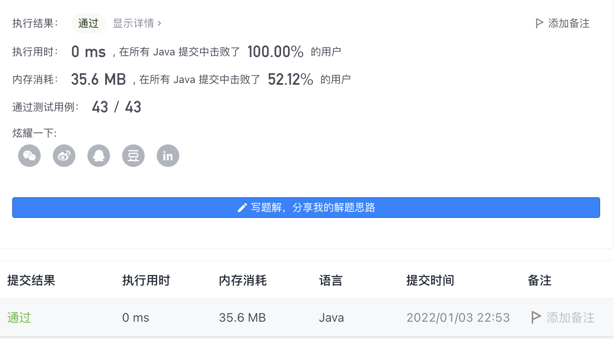

#### 1185. 一周中的第几天

#### 2022-01-03 LeetCode每日一题

链接：https://leetcode-cn.com/problems/day-of-the-week/

标签：**数学**

> 题目

给你一个日期，请你设计一个算法来判断它是对应一周中的哪一天。

输入为三个整数：day、month 和 year，分别表示日、月、年。

您返回的结果必须是这几个值中的一个 {"Sunday", "Monday", "Tuesday", "Wednesday", "Thursday", "Friday", "Saturday"}。 

示例 1：

```java
输入：day = 31, month = 8, year = 2019
输出："Saturday"
```

示例 2：

```java
输入：day = 18, month = 7, year = 1999
输出："Sunday"
```

示例 3：

```java
输入：day = 15, month = 8, year = 1993
输出："Sunday"
```


提示：

- 给出的日期一定是在 1971 到 2100 年之间的有效日期。

> 分析

1970-12-31是星期四，计算从1971-01-01到给定年月日之间的天数，然后取模就能求得这一天是星期几。注意平年2月份28天，闰年2月份29天。

> 编码

```java
class Solution {
    public String dayOfTheWeek(int day, int month, int year) {
        // 1970-12-31 Thursday
        String[] week = {"Sunday", "Monday", "Tuesday", "Wednesday", "Thursday", "Friday", "Saturday"};
        int[] nums = {31, 28, 31, 30, 31, 30, 31, 31, 30, 31, 30 ,31};
        int days = 0;
        for (int i = 1971; i < year; i++) {
            days += 365;
            if ((i % 4 == 0 && i % 100 != 0) || (i % 400 == 0)) {
                days++;
            }
        }
        for (int i = 1; i < month; i++) {
            days += nums[i - 1];
            if (i == 2 && ((year % 4 == 0 && year % 100 != 0) || (i % 400 == 0))) {
                days += 1;
            }
        }
        days += day;
        days += 4;
        return week[days % 7];
    }
}
```

