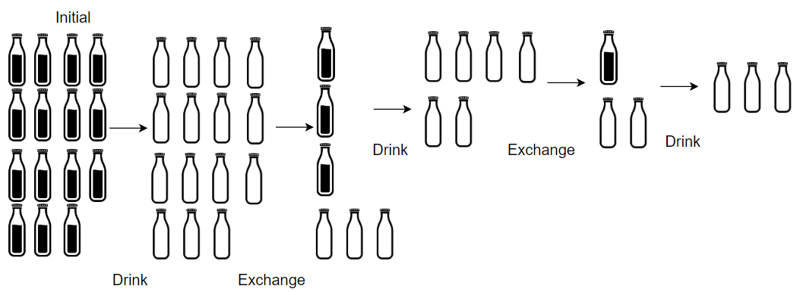

#### 1518. 换酒问题

#### 2021-12-18 LeetCode每日一题

链接：https://leetcode-cn.com/problems/water-bottles/

标签：**数学、模拟**

> 题目

小区便利店正在促销，用 numExchange 个空酒瓶可以兑换一瓶新酒。你购入了 numBottles 瓶酒。

如果喝掉了酒瓶中的酒，那么酒瓶就会变成空的。

请你计算 最多 能喝到多少瓶酒。

示例 1：


```java
输入：numBottles = 9, numExchange = 3
输出：13
解释：你可以用 3 个空酒瓶兑换 1 瓶酒。
所以最多能喝到 9 + 3 + 1 = 13 瓶酒。
```

示例 2：



```java
输入：numBottles = 15, numExchange = 4
输出：19
解释：你可以用 4 个空酒瓶兑换 1 瓶酒。
所以最多能喝到 15 + 3 + 1 = 19 瓶酒。
```

示例 3：

```java
输入：numBottles = 5, numExchange = 5
输出：6
```

示例 4：

```java
输入：numBottles = 2, numExchange = 3
输出：2
```


提示：

- 1 <= numBottles <= 100
- 2 <= numExchange <= 100

> 分析

不断循环判断空瓶数量 >= 换一瓶酒需要的空瓶数量，同时记录喝完所有酒后留下的空瓶数量。

> 编码

```java
class Solution {
    public int numWaterBottles(int numBottles, int numExchange) {
        int ans = numBottles;
        // 空瓶的数量
        int nullBottles = numBottles;

        while (nullBottles >= numExchange) {
            int mod = nullBottles % numExchange;
            // 空瓶可以换几瓶酒
            nullBottles = nullBottles / numExchange;
            ans += nullBottles;
            nullBottles += mod;
        }

        return ans;
    }
}
```

