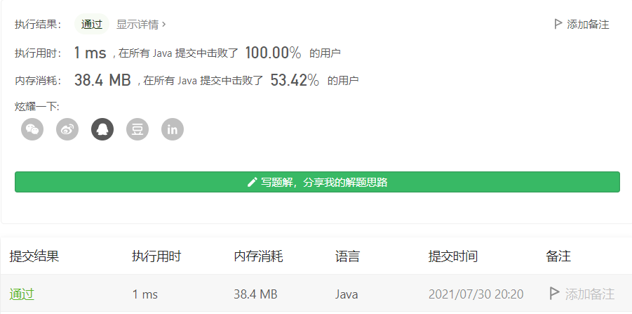

#### 171. Excel 表列序号

#### 2021-07-30 LeetCode每日一题

链接：https://leetcode-cn.com/problems/excel-sheet-column-number/

标签：**字符串、数学**

> 题目

给你一个字符串 columnTitle ，表示 Excel 表格中的列名称。返回该列名称对应的列序号。

例如，

    A -> 1
    B -> 2
    C -> 3
    ...
    Z -> 26
    AA -> 27
    AB -> 28 
    ...


示例 1:

```java
输入: columnTitle = "A"
输出: 1
```

示例 2:

```java
输入: columnTitle = "AB"
输出: 28
```

示例 3:

```java
输入: columnTitle = "ZY"
输出: 701
```

示例 4:

```java
输入: columnTitle = "FXSHRXW"
输出: 2147483647
```


提示：

- 1 <= columnTitle.length <= 7
- columnTitle 仅由大写英文组成
- columnTitle 在范围 ["A", "FXSHRXW"] 内

> 分析

相当于26进制转10进制。

> 编码

```java
class Solution {
    /**
     * FXSHRXW
     * (W * (26 ^ 0)) + (X * (26 ^ 1)) + (R * (26 ^ 2)) + (H * (26 ^ 3)) + (S * (26 ^ 4)) + (X * (26 ^ 5)) + (F * (26 ^ 6))
     */
    public int titleToNumber(String columnTitle) {
        int res = 0;
        char[] letters = columnTitle.toCharArray();
        int bit = 0;
        for (int i = letters.length - 1; i >= 0; --i) {
            res += ((letters[i] - 'A' + 1) * Math.pow(26, bit));
            bit++;
        }

        return res;
    }
}
```

