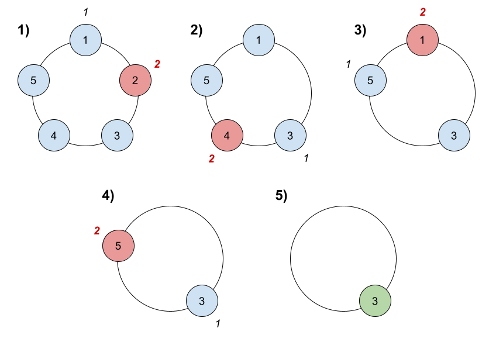

#### 1823. 找出游戏的获胜者

#### 2022-05-04 LeetCode每日一题

链接：https://leetcode-cn.com/problems/find-the-winner-of-the-circular-game/

标签：**数学、队列、模拟**

> 题目

共有 n 名小伙伴一起做游戏。小伙伴们围成一圈，按 顺时针顺序 从 1 到 n 编号。确切地说，从第 i 名小伙伴顺时针移动一位会到达第 (i+1) 名小伙伴的位置，其中 1 <= i < n ，从第 n 名小伙伴顺时针移动一位会回到第 1 名小伙伴的位置。

游戏遵循如下规则：

1、从第 1 名小伙伴所在位置 开始 。
2、沿着顺时针方向数 k 名小伙伴，计数时需要 包含 起始时的那位小伙伴。逐个绕圈进行计数，一些小伙伴可能会被数过不止一次。
3、你数到的最后一名小伙伴需要离开圈子，并视作输掉游戏。
4、如果圈子中仍然有不止一名小伙伴，从刚刚输掉的小伙伴的 顺时针下一位 小伙伴 开始，回到步骤 2 继续执行。
5、否则，圈子中最后一名小伙伴赢得游戏。

给你参与游戏的小伙伴总数 n ，和一个整数 k ，返回游戏的获胜者。

示例 1：



```java
输入：n = 5, k = 2
输出：3
解释：游戏运行步骤如下：

1) 从小伙伴 1 开始。
2) 顺时针数 2 名小伙伴，也就是小伙伴 1 和 2 。
3) 小伙伴 2 离开圈子。下一次从小伙伴 3 开始。
4) 顺时针数 2 名小伙伴，也就是小伙伴 3 和 4 。
5) 小伙伴 4 离开圈子。下一次从小伙伴 5 开始。
6) 顺时针数 2 名小伙伴，也就是小伙伴 5 和 1 。
7) 小伙伴 1 离开圈子。下一次从小伙伴 3 开始。
8) 顺时针数 2 名小伙伴，也就是小伙伴 3 和 5 。
9) 小伙伴 5 离开圈子。只剩下小伙伴 3 。所以小伙伴 3 是游戏的获胜者。
```

示例 2：

```java
输入：n = 6, k = 5
输出：1
解释：小伙伴离开圈子的顺序：5、4、6、2、3 。小伙伴 1 是游戏的获胜者。
```


提示：

- 1 <= k <= n <= 500

> 分析

其实这就是一个约瑟夫环的问题。

解法1：可以参考这篇文章：https://blog.csdn.net/a_helloword/article/details/100048861

解法2：可以使用一个队列来模拟，先将编号1-n加入队列，然后循环n-1次，每次将第k个人出队，最后剩下那个就是获胜者。

> 编码

解法1:

```java
class Solution {
    public int findTheWinner(int n, int k) {
        int ans = 0;
        for (int i = 2; i <= n; i++) {
            ans = (ans + k) % i;
        }

        return ans + 1;
    }
}
```


解法2:

```java
class Solution {
    public int findTheWinner(int n, int k) {
        Queue<Integer> queue = new LinkedList<>();
        for (int i = 1; i <= n; i++) {
            queue.add(i);
        }
        for (int i = 1; i < n; i++) {
            for (int j = 1; j < k; j++) {
                queue.add(queue.poll());
            }
            queue.poll();
        }

        return queue.poll();
    }
}
```

