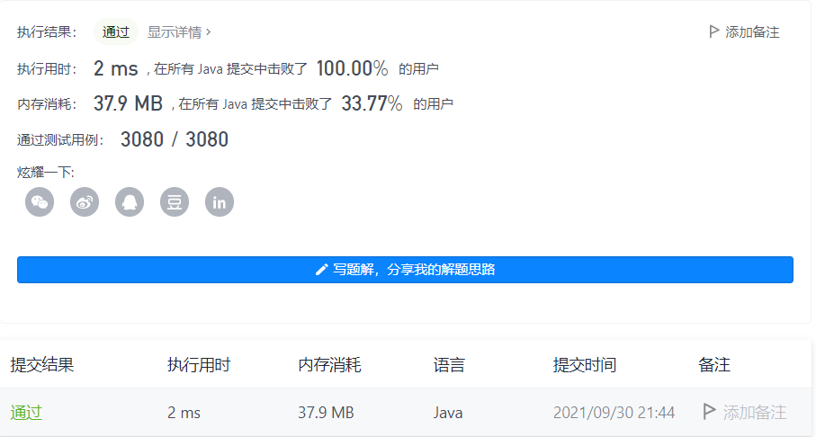
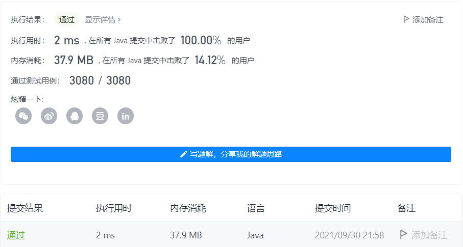

#### 223. 矩形面积

#### 2021-09-30 LeetCode每日一题

链接：https://leetcode-cn.com/problems/rectangle-area/

标签：**几何、数学**

> 题目

给你 二维 平面上两个 由直线构成的 矩形，请你计算并返回两个矩形覆盖的总面积。

每个矩形由其 左下 顶点和 右上 顶点坐标表示：

- 第一个矩形由其左下顶点 (ax1, ay1) 和右上顶点 (ax2, ay2) 定义。
- 第二个矩形由其左下顶点 (bx1, by1) 和右上顶点 (bx2, by2) 定义。


示例 1：


```java
输入：ax1 = -3, ay1 = 0, ax2 = 3, ay2 = 4, bx1 = 0, by1 = -1, bx2 = 9, by2 = 2
输出：45
```

示例 2：

```java
输入：ax1 = -2, ay1 = -2, ax2 = 2, ay2 = 2, bx1 = -2, by1 = -2, bx2 = 2, by2 = 2
输出：16
```


提示：

- -10 ^ 4 <= ax1, ay1, ax2, ay2, bx1, by1, bx2, by2 <= 10 ^ 4

> 分析

两个矩形的覆盖的总面积 = 矩形1的面积 + 矩形2的面积 - 公共面积。这里为了防止整型溢出，可以先减去公共面积再加上矩形2的面积。

矩形1和矩形2的面积我们很容易就能求出，问题在于如何求出公共面积。通过第[836.矩形重叠](https://leetcode-cn.com/problems/rectangle-overlap/)题，我们可以知道在哪些情况下两个矩形会发生重叠，发生重叠时，我们取左下角较大的横坐标和纵坐标，取右上角较小的横坐标和纵坐标，组成的就是重叠区域。

> 编码

```java
class Solution {
    public int computeArea(int ax1, int ay1, int ax2, int ay2, int bx1, int by1, int bx2, int by2) {
        int common = 0;
        // 有重叠区域
        if (!(bx1 >= ax2 || by1 >= ay2 || ax1 >= bx2 || ay1 >= by2)) {
            // 左下顶点较大的横坐标
            int x1 = Math.max(ax1, bx1);
            // 右上顶点较小的横坐标
            int x2 = Math.min(ax2, bx2);
            // 左下顶点较大的纵坐标
            int y1 = Math.max(ay1, by1);
            // 右上顶点较小的纵坐标
            int y2 = Math.min(ay2, by2);
            common = (x2 - x1) * (y2 - y1);
        }

        // 先减common，防止溢出
        return (bx2 - bx1) * (by2 - by1) - common + (ax2 - ax1) * (ay2 - ay1);
    }
}
```



```java
class Solution {
    public int computeArea(int ax1, int ay1, int ax2, int ay2, int bx1, int by1, int bx2, int by2) {
        // 计算两个矩形在x轴和y轴的重合长度，如果不存在重合，则相减为负数，和0相比取更大的那个数
        int x = Math.max(0, Math.min(ax2, bx2) - Math.max(ax1, bx1));
        int y = Math.max(0, Math.min(ay2, by2) - Math.max(ay1, by1));

        // 先减common，防止溢出
        return (bx2 - bx1) * (by2 - by1) - x * y + (ax2 - ax1) * (ay2 - ay1);
    }
}
```

