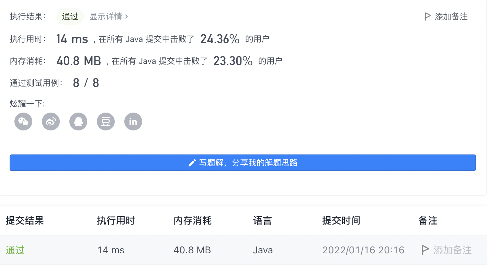

#### 382. 链表随机节点

#### 2022-01-16 LeetCode每日一题

链接：https://leetcode-cn.com/problems/linked-list-random-node/

标签：**水塘抽样、链表、数学、随机化**

> 题目

给你一个单链表，随机选择链表的一个节点，并返回相应的节点值。每个节点 被选中的概率一样 。

实现 Solution 类：

- Solution(ListNode head) 使用整数数组初始化对象。
- int getRandom() 从链表中随机选择一个节点并返回该节点的值。链表中所有节点被选中的概率相等。


示例：

```java
输入
["Solution", "getRandom", "getRandom", "getRandom", "getRandom", "getRandom"]
[[[1, 2, 3]], [], [], [], [], []]
输出
[null, 1, 3, 2, 2, 3]

解释
Solution solution = new Solution([1, 2, 3]);
solution.getRandom(); // 返回 1
solution.getRandom(); // 返回 3
solution.getRandom(); // 返回 2
solution.getRandom(); // 返回 2
solution.getRandom(); // 返回 3
// getRandom() 方法应随机返回 1、2、3中的一个，每个元素被返回的概率相等。
```


提示：

- 链表中的节点数在范围 [1, 10 ^ 4] 内
- -10 ^ 4 <= Node.val <= 10 ^ 4
- 至多调用 getRandom 方法 10 ^ 4 次


进阶：

- 如果链表非常大且长度未知，该怎么处理？
- 你能否在不使用额外空间的情况下解决此问题？

> 分析

要做这道题目，需要先学习一下**蓄水池抽样算法**，知道该算法的原理后，做起来就轻而易举了。

该算法的主要用来解决的问题是：**给定一个数据流，数据流长度N很大并且未知，如何在遍历一遍的情况下(O(N))，随机从中取出m个不重复的数据，并且取出m个数据的概率都要相等，即m / N**。

对于这题，就是每次从中取出一个数据，并且每个数据被取出的概率相等。

该算法的核心代码如下:

```java
int[] reservoir = new int[m];

// init
for (int i = 0; i < reservoir.length; i++)
{
    reservoir[i] = dataStream[i];
}

for (int i = m; i < dataStream.length; i++)
{
    // 随机获得一个[0, i]内的随机整数
    int d = rand.nextInt(i + 1);
    // 如果随机整数落在[0, m-1]范围内，则替换蓄水池中的元素
    if (d < m)
    {
        reservoir[d] = dataStream[i];
    }
}
```

这里使用已知长度的`dataStream`来代表未知长度的数据流，假设蓄水池的容量为m。`dataStream.length > m`。

算法思路大致如下：

1. 如果接收的数据量小于 m，则依次放入蓄水池。
2. 当接收到第 i 个数据时，i >= m，在 [0, i] 范围内取以随机数 d，若 d 的落在 [0, m-1] 范围内，则用接收到的第 i 个数据替换蓄水池中的第 d 个数据。
3. 重复步骤 2。

算法的精妙之处在于：**当处理完所有的数据时，蓄水池中的每个数据都是以 m/N 的概率获得的。**

下面是证明，假设数据开始的编号为1:

**第 i 个接收到的数据最后能够留在蓄水池中的概率** = **第 i 个数据进入过蓄水池的概率** * **之后第 i 个数据不被替换的概率**（第 i+1 到第 N 次处理数据都不会被替换）。

1. 当 i<=m 时，数据直接放进蓄水池，所以**第 i 个数据进入过蓄水池的概率 = 1**。
2. 当 i>m 时，在 [1,i] 内选取随机数 d，如果 d<=m，则使用第 i 个数据替换蓄水池中第 d 个数据，因此**第 i 个数据进入过蓄水池的概率 = m/i**。
3. 当 i<=m 时，程序从接收到第 m+1 个数据时开始执行替换操作，第 m+1 次处理会替换池中数据的为 m/(m+1)，会替换掉第 i 个数据的概率为 1/m，则第 m+1 次处理替换掉第 i 个数据的概率为 (m/(m+1))*(1/m)=1/(m+1)，不被替换的概率为 1-1/(m+1)=m/(m+1)。依次，第 m+2 次处理不替换掉第 i 个数据概率为 (m+1)/(m+2)… 第 N 次处理不替换掉第 i 个数据的概率为 (N-1)/N。所以，之后**第 i 个数据不被替换的概率 = m/(m+1)*(m+1)/(m+2)*…*(N-1)/N=m/N**。
4. 当 i>m 时，程序从接收到第 i+1 个数据时开始有可能替换第 i 个数据。第i+1次处理会替换池中数据的概率为m/i+1，会替换掉第i个数据的概率是1/m，则第i+1次处理会替换掉第i个数据的概率是1/i+1，不会被替换的概率是i/i+1。则参考上述第 3 点，**之后第 i 个数据不被替换的概率 = (i/i+1)((i+1)/(i+2))...((N-1)/N) = i/N**。
5. 结合第 1 点和第 3 点可知，当 i<=m 时，第 i 个接收到的数据最后留在蓄水池中的概率 = 1*m/N=m/N。结合第 2 点和第 4 点可知，当 i>m 时，第 i 个接收到的数据留在蓄水池中的概率 = m/i*i/N=m/N。综上可知，**每个数据最后被选中留在蓄水池中的概率为 m/N**。

这个算法建立在统计学基础上，很巧妙地获得了 “m/N” 这个概率。

关于该算法的讲解具体可以参考[这篇文章](https://stamwoo.github.io/4125998541/)

> 编码

```java
/**
 * Definition for singly-linked list.
 * public class ListNode {
 *     int val;
 *     ListNode next;
 *     ListNode() {}
 *     ListNode(int val) { this.val = val; }
 *     ListNode(int val, ListNode next) { this.val = val; this.next = next; }
 * }
 */
class Solution {
    private ListNode root;

    public Solution(ListNode head) {
        this.root = head;
    }
    
    public int getRandom() {
        int res = 0;
        int count = 1;
        ListNode head = root;
        Random random = new Random();

        while (head != null) {
            // 随机生成[0, count)之间的整数
            int num = random.nextInt(count++);
            // 如果随机值等于0，则进行替换
            if (num == 0) {
                res = head.val;
            }
            head = head.next;
        }

        return res;
    }
}

/**
 * Your Solution object will be instantiated and called as such:
 * Solution obj = new Solution(head);
 * int param_1 = obj.getRandom();
 */
```

