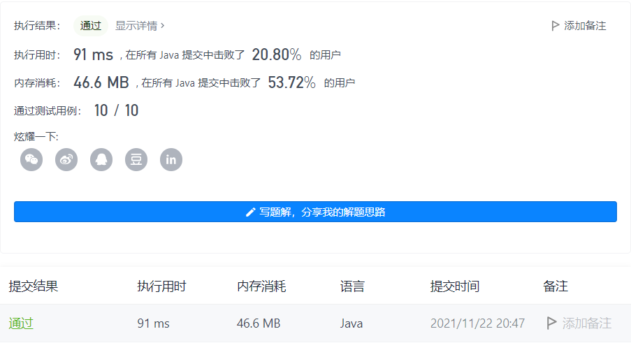

#### 384. 打乱数组

#### 2021-11-22 LeetCode每日一题

链接：https://leetcode-cn.com/problems/shuffle-an-array/

标签：**数组、数学、随机化**

> 题目

给你一个整数数组 nums ，设计算法来打乱一个没有重复元素的数组。

实现 Solution class:

- Solution(int[] nums) 使用整数数组 nums 初始化对象
- int[] reset() 重设数组到它的初始状态并返回
- int[] shuffle() 返回数组随机打乱后的结果


示例：

```java
输入
["Solution", "shuffle", "reset", "shuffle"]
[[[1, 2, 3]], [], [], []]
输出
[null, [3, 1, 2], [1, 2, 3], [1, 3, 2]]

解释
Solution solution = new Solution([1, 2, 3]);
solution.shuffle();    // 打乱数组 [1,2,3] 并返回结果。任何 [1,2,3]的排列返回的概率应该相同。例如，返回 [3, 1, 2]
solution.reset();      // 重设数组到它的初始状态 [1, 2, 3] 。返回 [1, 2, 3]
solution.shuffle();    // 随机返回数组 [1, 2, 3] 打乱后的结果。例如，返回 [1, 3, 2]
```


提示：

- 1 <= nums.length <= 200
- -10 ^ 6 <= nums[i] <= 10 ^ 6
- nums 中的所有元素都是 唯一的
- 最多可以调用 5 * 10 ^ 4 次 reset 和 shuffle

> 分析

洗牌(随机)算法有很多应用，例如我们平时用的音乐播放器随机播放，棋牌游戏中的洗牌，扫雷游戏中雷的位置随机等等，都会用到洗牌算法。

今天来介绍一个简单，公平，时间复杂度为 O(n)的洗牌算法。什么是洗牌算法呢？其实就是将一些数据以公平随机的方式打乱顺序。这个算法，是由 Knuth(高纳德)，也就是计算机程序设计艺术的作者发明的。

假设有这样一个数组 `[1, 2, 3, 4, 5, 6, 7, 8, 9, 10]`，我们使用 Knuth-Shuffle 算法将数据打乱。基本流程是这样的，从最后一个数开始，往前遍历，每一次，从当前数和第 1 个数之间，随机选择一个数，与当前数字进行交换（这里的随机选择就直接使用程序语言中的 Random 随机一个索引即可）。

例如上面的数组，第一次循环，当前数字为 10，我们从 1~10 之间，随机选择一个数，与 10 交换，这样第 9 个索引位就算洗完了，接下来就是第 8 个索引位，也就是数字为 9，我们从第 1 个索引位与第 8 个索引位之间，选择一个数，第 9 交换，这样第 8 个索引位也就洗完了...。这个算法之所以公平，是因为保证了每一个元素出现在每一个位置上的概率，都是一样的。

> 编码

```java
class Solution {
    private int[] nums;
    public Solution(int[] nums) {
        this.nums = nums;
    }
    
    public int[] reset() {
        return this.nums;
    }
    
    public int[] shuffle() {
        int[] copy = nums.clone();
        Random random = new Random();
        for (int i = 0; i < copy.length; i++) {
            // 生成[i, copy.length)随机数
            int index = i + random.nextInt(copy.length - i);
            // 交换copy[i]和copy[temp]
            int temp = copy[index];
            copy[index] = copy[i];
            copy[i] = temp;
        }

        return copy;
    }
}

/**
 * Your Solution object will be instantiated and called as such:
 * Solution obj = new Solution(nums);
 * int[] param_1 = obj.reset();
 * int[] param_2 = obj.shuffle();
 */
```

