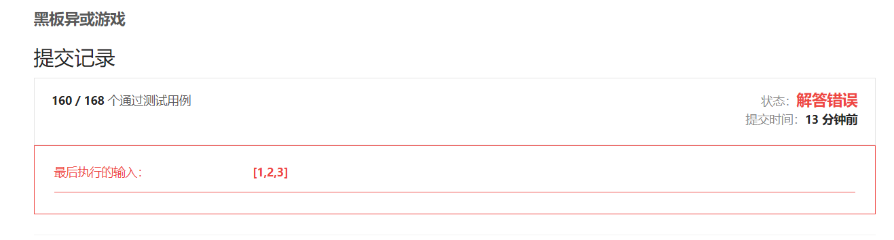
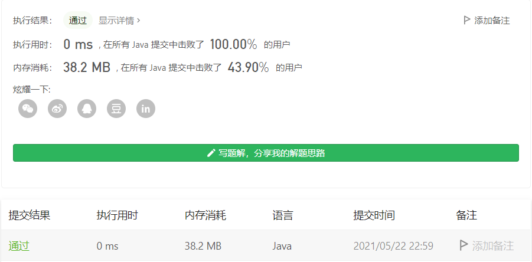

#### 810. 黑板异或游戏

#### 2021-05-22 LeetCode每日一题

链接：https://leetcode-cn.com/problems/chalkboard-xor-game/

标签：**数学、异或**

> 题目

黑板上写着一个非负整数数组 nums[i] 。Alice 和 Bob 轮流从黑板上擦掉一个数字，Alice 先手。如果擦除一个数字后，剩余的所有数字按位异或运算得出的结果等于 0 的话，当前玩家游戏失败。 (另外，如果只剩一个数字，按位异或运算得到它本身；如果无数字剩余，按位异或运算结果为 0。）

并且，轮到某个玩家时，如果当前黑板上所有数字按位异或运算结果等于 0，这个玩家获胜。

假设两个玩家每步都使用最优解，当且仅当 Alice 获胜时返回 true。

```java
输入: nums = [1, 1, 2]
输出: false
解释: 
Alice 有两个选择: 擦掉数字 1 或 2。
如果擦掉 1, 数组变成 [1, 2]。剩余数字按位异或得到 1 XOR 2 = 3。那么 Bob 可以擦掉任意数字，因为 Alice 会成为擦掉最后一个数字的人，她总是会输。
如果 Alice 擦掉 2，那么数组变成[1, 1]。剩余数字按位异或得到 1 XOR 1 = 0。Alice 仍然会输掉游戏。

1 <= N <= 1000
0 <= nums[i] <= 2^16
```

> 分析

这种题目，看到标签就一个孤零零的异或在那里，就知道需要开始抖机灵了。

盲猜当数字个数为奇数时，Alice必输，数字个数为偶数时，Alice必胜。

> 编码

```java
class Solution {
    public boolean xorGame(int[] nums) {
        if (nums.length % 2 == 0) {
            return true;
        }

        return false;
    }
}
```

好家伙，直接通过160个测试用例。



此刻需要注意审题，**轮到某个玩家时，如果当前黑板上所有数字按位异或运算结果等于 0，这个玩家获胜。**所以不管个数是奇数还是偶数，如果一开始所有数异或的结果就是0，那么Alice就是胜利者。所以改下代码就行了。

```java
class Solution {
    public boolean xorGame(int[] nums) {
        // 轮到某个玩家时，如果当前黑板上所有数字按位异或运算结果等于 0，这个玩家获胜。
        // 如果一开始所有数据异或就为0，则alice直接获胜
        int res = 0;
        for (int i = 0; i < nums.length; i++) {
            res ^= nums[i];
        }

        if (res == 0 || nums.length % 2 == 0) {
            return true;
        }

        return false;
    }
}
```



时间复杂度O(n)，空间复杂度O(1)

其实这也不是抖机灵，是有推理过程的：

- 1、如果一开始所有的数异或为0，Alice获胜。

- 2、所有的数异或不为0
  - 2.1 如果数组中存在重复的数，Alice选一个数，那么bob会选另一个相同的数，这也bob才可能不输，因为两个相同的数异或等于0，去掉两个相同的数，对结果没有任何影响。
  - 2.2 重复若干次，可以将重复的数两两去除（重复偶数次就全部去掉了，奇数次就保留一个），剩下的数，异或结果还是和原来相同并且不为0。
  - 2.3 此时剩下的数的个数 & 上面重复的次数
    - 2.3.1 如果是剩下的数是奇数个 & 重复的次数为奇数次，那么说明数的总个数为偶数（奇数 + 奇数 = 偶数），此时轮到了bob选数，因为两个人都选对自己有利的数，所以轮到bob选数的时候，选完一个后剩下的数异或结果为0，那他可以换另一个数，这样剩下的数异或结果必不为0（因为不存在相同的数）。同样Alice也是这样，那么最后一个数肯定是Bob选的，Bob选完后，没数可选了，必输。
    - 2.3.2 如果是剩下的数是奇数个 & 重复的次数为偶数次，那么说明数的总个数为奇数，此时轮到Alice选数，和上面一样，最后一个数肯定是Alice选的，Alice必输。
    - 2.3.3 如果是剩下的数是偶数个 & 重复的次数为奇数次，那么说明数的总个数为奇数，此时轮到Bob选数，和上面一样，最后一个数肯定是Alice选的，Alice必输。
    - 2.3.4 如果是剩下的数是偶数个 & 重复的次数为偶数次，那么说明数的总个数为偶数，此时轮到Alice选数，和上面一样，最后一个数肯定是Bob选的，Bob必输。

综上，在不考虑一开始所有数异或结果就为0的情况，当数的个数为奇数的时候，Alice必输，数的个数为偶数的时候，Bob必输。

