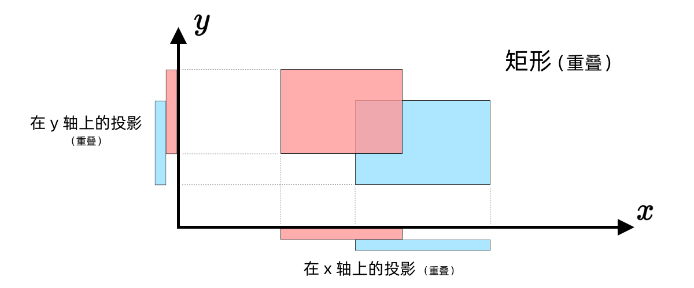
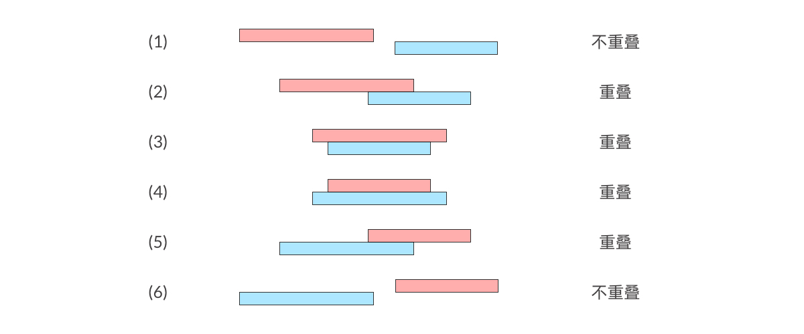
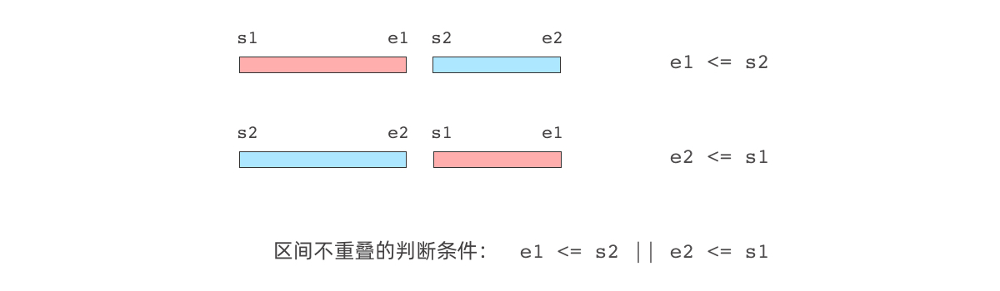
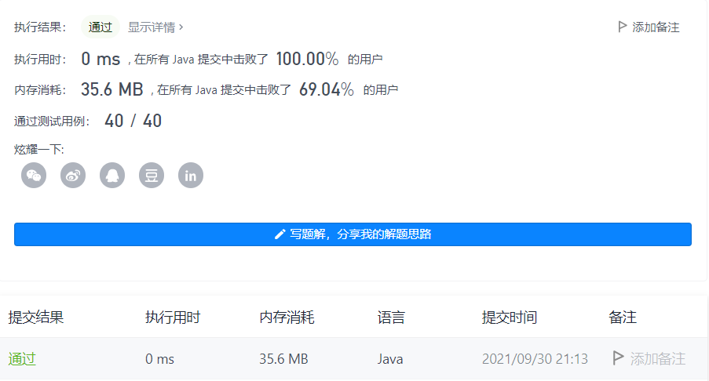

#### 836. 矩形重叠

链接：https://leetcode-cn.com/problems/rectangle-overlap/

标签：**几何、数学**

> 题目

矩形以列表 [x1, y1, x2, y2] 的形式表示，其中 (x1, y1) 为左下角的坐标，(x2, y2) 是右上角的坐标。矩形的上下边平行于 x 轴，左右边平行于 y 轴。

如果相交的面积为 正 ，则称两矩形重叠。需要明确的是，只在角或边接触的两个矩形不构成重叠。

给出两个矩形 rec1 和 rec2 。如果它们重叠，返回 true；否则，返回 false 。

示例 1：

```java
输入：rec1 = [0,0,2,2], rec2 = [1,1,3,3]
输出：true
```

示例 2：

```java
输入：rec1 = [0,0,1,1], rec2 = [1,0,2,1]
输出：false
```

示例 3：

```java
输入：rec1 = [0,0,1,1], rec2 = [2,2,3,3]
输出：false
```


提示：

- rect1.length == 4
- rect2.length == 4
- -10 ^ 9 <= rec1[i], rec2[i] <= 10 ^ 9
- rec1[0] <= rec1[2] 且 rec1[1] <= rec1[3]
- rec2[0] <= rec2[2] 且 rec2[1] <= rec2[3]

> 分析



可以将矩形投影到坐标轴上，这样就把二维问题转为为一维问题了。两个投影可能出现的情况如下



可知重叠的情况比不重叠的情况更多，利用反证法，我们求出不重叠的情况，那么剩下的就是重叠的情况了。

而不重叠时，满足以下条件



即s2在e1点的右边或者上边，即s2的横坐标大于等于e1的横坐标或者s2的纵坐标大于等于e1的纵坐标。`rec2[0] >= rec1[2] || rec2[1] >= rec1[3]`

或者s1在e2点的右边或者上边。`rec1[0] >= rec2[2] || rec1[1] >= rec2[3]`

所以不重叠的情况如下：`rec2[0] >= rec1[2] || rec2[1] >= rec1[3] || rec1[0] >= rec2[2] || rec1[1] >= rec2[3] `

重叠的情况进行取反即可。

> 编码

```java
class Solution {
    public boolean isRectangleOverlap(int[] rec1, int[] rec2) {
        // 反证法，排除不可能重叠的情况，剩下的就是可能的情况。
        return !(rec1[0] >= rec2[2] || rec1[2] <= rec2[0] || rec1[1] >= rec2[3] || rec2[1] >= rec1[3]);
    }
}
```

