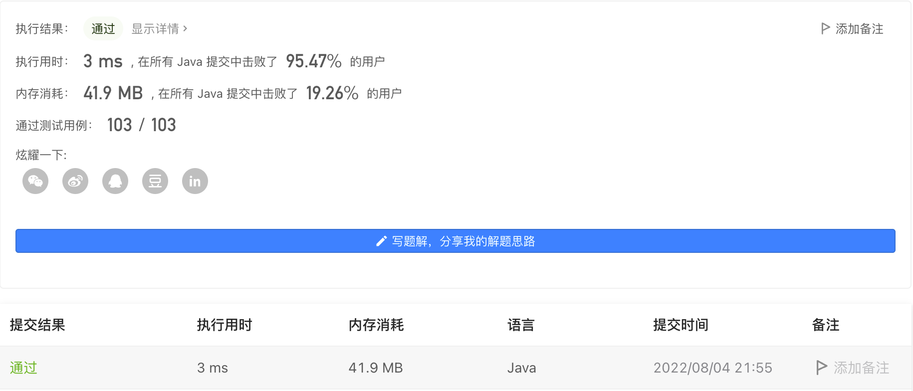

#### 1403. 非递增顺序的最小子序列

#### 2022-08-04 LeetCode每日一题

链接：https://leetcode.cn/problems/minimum-subsequence-in-non-increasing-order/

标签：**贪心、数组、排序**

> 题目

给你一个数组 nums，请你从中抽取一个子序列，满足该子序列的元素之和 严格 大于未包含在该子序列中的各元素之和。

如果存在多个解决方案，只需返回 长度最小 的子序列。如果仍然有多个解决方案，则返回 元素之和最大 的子序列。

与子数组不同的地方在于，「数组的子序列」不强调元素在原数组中的连续性，也就是说，它可以通过从数组中分离一些（也可能不分离）元素得到。

注意，题目数据保证满足所有约束条件的解决方案是 唯一 的。同时，返回的答案应当按 非递增顺序 排列。 

示例 1：

```java
输入：nums = [4,3,10,9,8]
输出：[10,9] 
解释：子序列 [10,9] 和 [10,8] 是最小的、满足元素之和大于其他各元素之和的子序列。但是 [10,9] 的元素之和最大。 
```

示例 2：

```java
输入：nums = [4,4,7,6,7]
输出：[7,7,6] 
解释：子序列 [7,7] 的和为 14 ，不严格大于剩下的其他元素之和（14 = 4 + 4 + 6）。因此，[7,6,7] 是满足题意的最小子序列。注意，元素按非递增顺序返回。  
```

示例 3：

```java
输入：nums = [6]
输出：[6]
```


提示：

- 1 <= nums.length <= 500
- 1 <= nums[i] <= 100

> 分析

根据题意，我们需要获取的是长度最小、和最大的子序列。基本思路就是先排序，然后从大到小取元素，当取的元素总和大于所有元素总和的一半时，返回此时已取元素序列。

> 编码

```java
class Solution {
    public List<Integer> minSubsequence(int[] nums) {
        List<Integer> res = new ArrayList<>();
        Arrays.sort(nums);
        //nums = Arrays.stream(nums).boxed().sorted((a, b) -> b - a).mapToInt(p -> p).toArray();
        //int sum = Arrays.stream(nums).sum();
        int count = 0, sum = 0;
        for (int i = 0; i < nums.length; i++) {
            sum += nums[i];
        }

        for (int i = nums.length - 1; i >= 0; --i) {
            if (count <= sum) {
                res.add(nums[i]);
                count += nums[i];
                sum -= nums[i];
            }
        }

        return res;
    }
}
```

