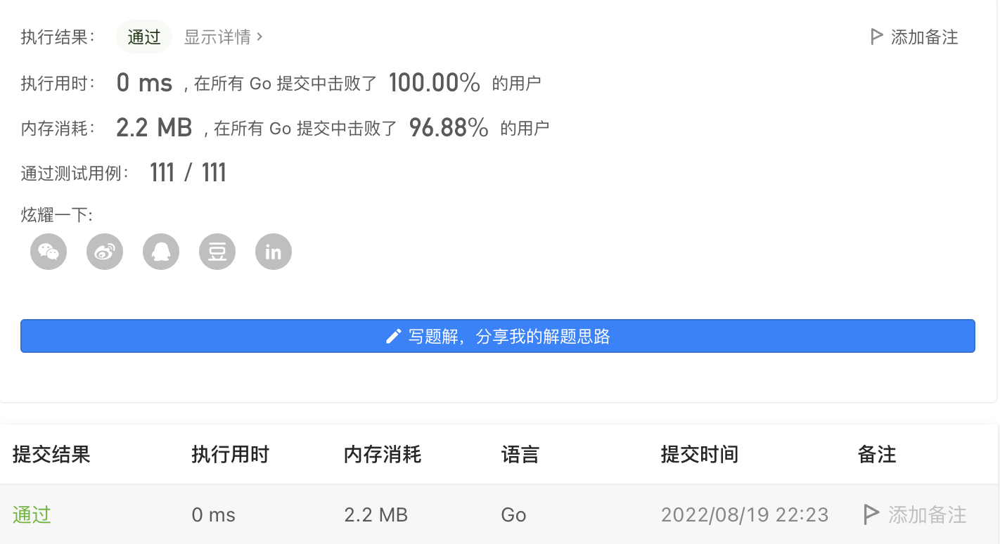

#### 1450. 在既定时间做作业的学生人数

#### 2022-08-19 LeetCode每日一题

链接：https://leetcode.cn/problems/number-of-students-doing-homework-at-a-given-time/

标签：**数组**

> 题目

给你两个整数数组 startTime（开始时间）和 endTime（结束时间），并指定一个整数 queryTime 作为查询时间。

已知，第 i 名学生在 startTime[i] 时开始写作业并于 endTime[i] 时完成作业。

请返回在查询时间 queryTime 时正在做作业的学生人数。形式上，返回能够使 queryTime 处于区间 [startTime[i], endTime[i]]（含）的学生人数。 

示例 1：

```java
输入：startTime = [1,2,3], endTime = [3,2,7], queryTime = 4
输出：1
解释：一共有 3 名学生。
第一名学生在时间 1 开始写作业，并于时间 3 完成作业，在时间 4 没有处于做作业的状态。
第二名学生在时间 2 开始写作业，并于时间 2 完成作业，在时间 4 没有处于做作业的状态。
第三名学生在时间 3 开始写作业，预计于时间 7 完成作业，这是是唯一一名在时间 4 时正在做作业的学生。
```

示例 2：

```java
输入：startTime = [4], endTime = [4], queryTime = 4
输出：1
解释：在查询时间只有一名学生在做作业。
```

示例 3：

```java
输入：startTime = [4], endTime = [4], queryTime = 5
输出：0
```

示例 4：

```java
输入：startTime = [1,1,1,1], endTime = [1,3,2,4], queryTime = 7
输出：0
```

示例 5：

```java
输入：startTime = [9,8,7,6,5,4,3,2,1], endTime = [10,10,10,10,10,10,10,10,10], queryTime = 5
输出：5
```


提示：

- startTime.length == endTime.length
- 1 <= startTime.length <= 100
- 1 <= startTime[i] <= endTime[i] <= 1000
- 1 <= queryTime <= 1000

> 分析

直接写就行。

> 编码

```java
class Solution {
    public int busyStudent(int[] startTime, int[] endTime, int queryTime) {
        int res = 0;
        for (int i = 0; i < startTime.length; i++) {
            if (startTime[i] <= queryTime && queryTime <= endTime[i]) {
                res++;
            }
        }

        return res;
    }
}
```


```go
func busyStudent(startTime []int, endTime []int, queryTime int) int {
    res := 0
    for i := range startTime {
        if startTime[i] <= queryTime && queryTime <= endTime[i] {
            res++
        }
    }
    return res
}
```

