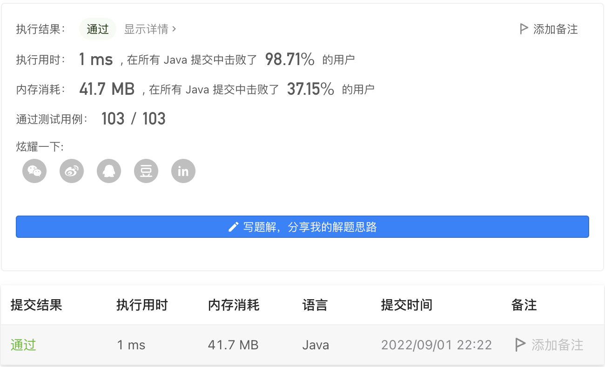
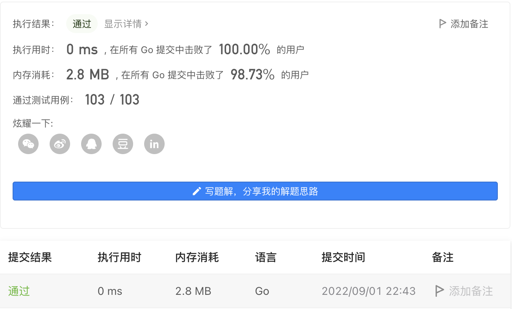

#### 1475. 商品折扣后的最终价格

#### 2022-09-01 LeetCode每日一题

链接：https://leetcode.cn/problems/final-prices-with-a-special-discount-in-a-shop/

标签：**栈、数组、单调栈**

> 题目

给你一个数组 prices ，其中 prices[i] 是商店里第 i 件商品的价格。

商店里正在进行促销活动，如果你要买第 i 件商品，那么你可以得到与 prices[j] 相等的折扣，其中 j 是满足 j > i 且 prices[j] <= prices[i] 的 最小下标 ，如果没有满足条件的 j ，你将没有任何折扣。

请你返回一个数组，数组中第 i 个元素是折扣后你购买商品 i 最终需要支付的价格。

示例 1：

```java
输入：prices = [8,4,6,2,3]
输出：[4,2,4,2,3]
解释：
商品 0 的价格为 price[0]=8 ，你将得到 prices[1]=4 的折扣，所以最终价格为 8 - 4 = 4 。
商品 1 的价格为 price[1]=4 ，你将得到 prices[3]=2 的折扣，所以最终价格为 4 - 2 = 2 。
商品 2 的价格为 price[2]=6 ，你将得到 prices[3]=2 的折扣，所以最终价格为 6 - 2 = 4 。
商品 3 和 4 都没有折扣。
```

示例 2：

```java
输入：prices = [1,2,3,4,5]
输出：[1,2,3,4,5]
解释：在这个例子中，所有商品都没有折扣。
```

示例 3：

```java
输入：prices = [10,1,1,6]
输出：[9,0,1,6]
```


提示：

- 1 <= prices.length <= 500
- 1 <= prices[i] <= 10^3

> 分析

数据量不大的时候可以使用暴力法，双层循环。

也可以使用**单调栈**。倒序遍历数组，把元素放入栈中，栈的特点是后进先出，即后进的元素都在栈顶。所以对于当前元素price[i]，

- 查看栈顶元top[j] > price[i]，则弹出，直到top[j] <= price[i]，此时j满足条件。
- 如果栈为空，则说明没有折扣。
- 把price[i]放入栈顶。

> 编码

```java
class Solution {
    public int[] finalPrices(int[] prices) {
        int len = prices.length;
        for (int i = 0; i < len; i++) {
            for (int j = i + 1; j < len; j++) {
                if (prices[j] <= prices[i]) {
                    prices[i] -= prices[j];
                    break;
                }
            }
        }

        return prices;
    }
}
```



```java
class Solution {
    public int[] finalPrices(int[] prices) {
        int len = prices.length;
        int[] ans = new int[len];
        Deque<Integer> deque = new LinkedList<>();
        // 从右往左遍历
        for (int i = len - 1; i >= 0; --i) {
            // 查找price[i]右边第一个小于等于price[i]的元素
            while (!deque.isEmpty() && deque.peekFirst() > prices[i]) {
                // 如果大于则直接丢弃
                deque.pollFirst();
            }
            ans[i] = deque.isEmpty() ? prices[i] : prices[i] - deque.peekFirst();
            deque.addFirst(prices[i]);
        }

        return ans;
    }
}
```


```go
func finalPrices(prices []int) []int {
    for i, e := range prices {
        for _, p := range prices[i + 1:] {
            if p <= e {
                prices[i] = e - p
                break
            }
        }
    }

    return prices
}
```

