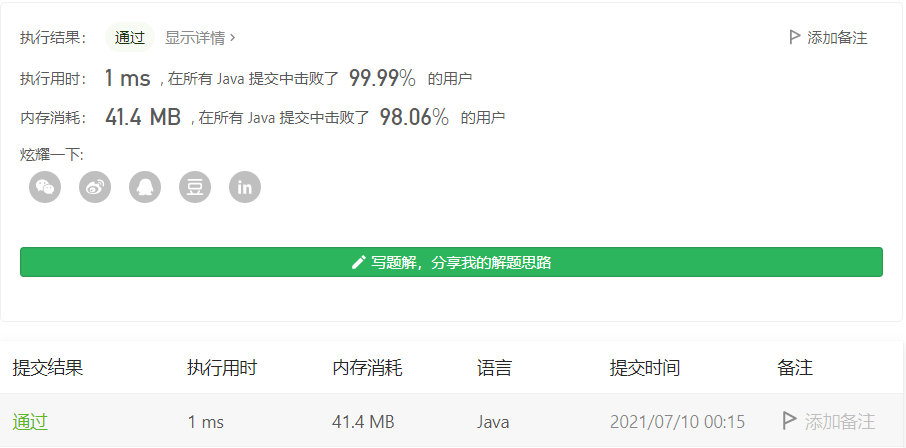

#### 169. 多数元素

链接：https://leetcode-cn.com/problems/majority-element/

标签：**数组、哈希表、分治、计数、排序**

> 题目

给定一个大小为 n 的数组，找到其中的多数元素。多数元素是指在数组中出现次数 大于 ⌊ n/2 ⌋ 的元素。

你可以假设数组是非空的，并且给定的数组总是存在多数元素。

 **示例 1：**

```
输入：[3,2,3]
输出：3
```

**示例 2：**

```
输入：[2,2,1,1,1,2,2]
输出：2
```

> 分析

此题可以使用**摩尔投票法**解决，关于摩尔投票法，可以看[这篇文章](https://github.com/stronglxp/learnNote/blob/main/leetcode/%E8%A7%A3%E9%A2%98%E6%96%B9%E6%B3%95%E6%80%BB%E7%BB%93/%E4%BD%BF%E7%94%A8%E6%91%A9%E5%B0%94%E6%8A%95%E7%A5%A8%E6%B3%95%E8%A7%A3%E5%86%B3%E6%B1%82%E5%A4%9A%E6%95%B0%E9%97%AE%E9%A2%98.md)。因为题目保证存在多数元素，所以我们不需要验证最后剩下的那个数是否是多数元素。

> 编码

```java
class Solution {
    public int majorityElement(int[] nums) {
        int major = 0, count = 0;
        for (int i = 0; i < nums.length; i++) {
            if (count == 0) {
                major = nums[i];
            }
            if (major == nums[i]) {
                count++;
            } else {
                count--;
            }
        }

        return major;
    }
}
```

