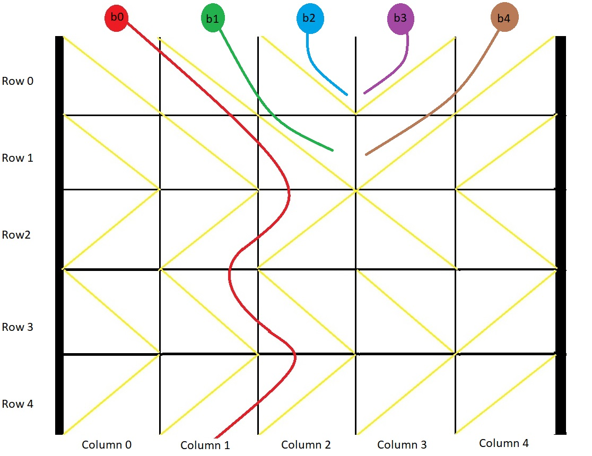

#### 1706. 球会落何处

#### 2022-02-24 LeetCode每日一题

链接：https://leetcode-cn.com/problems/where-will-the-ball-fall/

标签：**深度优先搜索、数组、矩阵、动态规划、模拟**

> 题目

用一个大小为 m x n 的二维网格 grid 表示一个箱子。你有 n 颗球。箱子的顶部和底部都是开着的。

箱子中的每个单元格都有一个对角线挡板，跨过单元格的两个角，可以将球导向左侧或者右侧。

- 将球导向右侧的挡板跨过左上角和右下角，在网格中用 1 表示。
- 将球导向左侧的挡板跨过右上角和左下角，在网格中用 -1 表示。

在箱子每一列的顶端各放一颗球。每颗球都可能卡在箱子里或从底部掉出来。如果球恰好卡在两块挡板之间的 "V" 形图案，或者被一块挡导向到箱子的任意一侧边上，就会卡住。

返回一个大小为 n 的数组 answer ，其中 answer[i] 是球放在顶部的第 i 列后从底部掉出来的那一列对应的下标，如果球卡在盒子里，则返回 -1 。

示例 1：



```java
输入：grid = [[1,1,1,-1,-1],[1,1,1,-1,-1],[-1,-1,-1,1,1],[1,1,1,1,-1],[-1,-1,-1,-1,-1]]
输出：[1,-1,-1,-1,-1]
解释：示例如图：
b0 球开始放在第 0 列上，最终从箱子底部第 1 列掉出。
b1 球开始放在第 1 列上，会卡在第 2、3 列和第 1 行之间的 "V" 形里。
b2 球开始放在第 2 列上，会卡在第 2、3 列和第 0 行之间的 "V" 形里。
b3 球开始放在第 3 列上，会卡在第 2、3 列和第 0 行之间的 "V" 形里。
b4 球开始放在第 4 列上，会卡在第 2、3 列和第 1 行之间的 "V" 形里。
```

示例 2：

```java
输入：grid = [[-1]]
输出：[-1]
解释：球被卡在箱子左侧边上。
```

示例 3：

```java
输入：grid = [[1,1,1,1,1,1],[-1,-1,-1,-1,-1,-1],[1,1,1,1,1,1],[-1,-1,-1,-1,-1,-1]]
输出：[0,1,2,3,4,-1]
```


提示：

- m == grid.length
- n == grid[i].length
- 1 <= m, n <= 100
- grid[i] [j] 为 1 或 -1

> 分析

由题意可知，当位于第m行时，

- 如果第i列的挡板跨过左上角和右下角，那么如果第 i + 1（i + 1 < len）列挡板也是跨过左上角和右下角，则该球能通过第m行；
- 如果第i列的挡板跨过右上角和左下角，那么如果第 i - 1（i - 1 >= 0）列挡板也是跨过右上角和左下角，则该球能通过第m行。

特殊情况下，当球位于开始或者末尾那一列时

- 如果位于第一列并且挡板跨过左上角和右下角，那么如果存在下一列，则会进入上面可通过的逻辑判断。
- 如果位于第一列并且挡板跨过右上角和左下角，那么直接卡住了。
- 如果位于最后一列并且挡板跨过左上角和右下角，不存在下一列，直接卡住。
- 如果位于最后一列并且挡板跨过右上角和左下角，那么如果存在前一列，则会进入上面可通过的逻辑判断。

对于第i列的小球最后会落在哪一列用ans[i]表示。初始化时ans[i] = i。对于可通过的情况，ans[i] += grid[i] [ans[i]]；对于不通过的情况，ans[i] = -1。

> 编码

```java
class Solution {
    public int[] findBall(int[][] grid) {
        int[] ans = new int[grid[0].length];
        for (int i = 0; i < ans.length; i++) {
            ans[i] = i;
        }

        // 每一行
        for (int i = 0; i < grid.length; i++) {
            // 每个球在第i行的下落情况
            for (int j = 0; j < grid[i].length; j++) {
                // 此时球在第ans[j]列
                if (ans[j] != -1) {
                    // 第ans[j]列和左右两列同方向，则不会卡住
                    if ((grid[i][ans[j]] == 1 && ans[j] + 1 < grid[i].length && grid[i][ans[j] + 1] == 1) || (grid[i][ans[j]] == -1 && ans[j] - 1 >= 0 && grid[i][ans[j] - 1] == -1)) {
                        ans[j] += grid[i][ans[j]];
                    } else {
                        ans[j] = -1;
                    }
                }
            }
        }

        return ans;
    }
}
```

