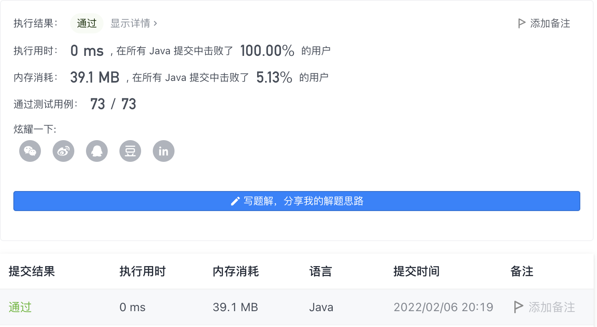

#### 1748. 唯一元素的和

#### 2022-02-06 LeetCode每日一题

链接：https://leetcode-cn.com/problems/sum-of-unique-elements/

标签：**数组、哈希表、计数**

> 题目

给你一个整数数组 nums 。数组中唯一元素是那些只出现 恰好一次 的元素。

请你返回 nums 中唯一元素的 和 。 

示例 1：

```java
输入：nums = [1,2,3,2]
输出：4
解释：唯一元素为 [1,3] ，和为 4 。
```

示例 2：

```java
输入：nums = [1,1,1,1,1]
输出：0
解释：没有唯一元素，和为 0 。
```

示例 3 ：

```java
输入：nums = [1,2,3,4,5]
输出：15
解释：唯一元素为 [1,2,3,4,5] ，和为 15 。
```


提示：

- 1 <= nums.length <= 100
- 1 <= nums[i] <= 100

> 分析

把每个数字出现的次数记录下来，然后把出现次数为1的数进行相加。

> 编码

```java
class Solution {
    public int sumOfUnique(int[] nums) {
        int ans = 0;
        int[] flag = new int[101];
        for (int i = 0; i < nums.length; i++) {
            if (flag[nums[i]] == 1) {
                ans -= nums[i];
            } else if (flag[nums[i]] == 0) {
                ans += nums[i];
            }
            flag[nums[i]]++;
        }

        return ans;
    }
}
```

