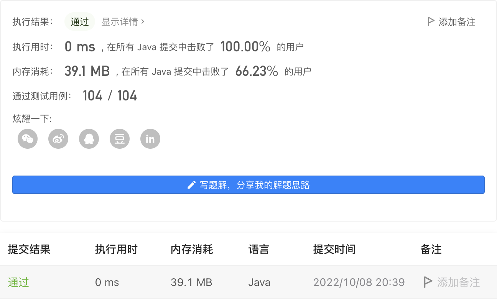
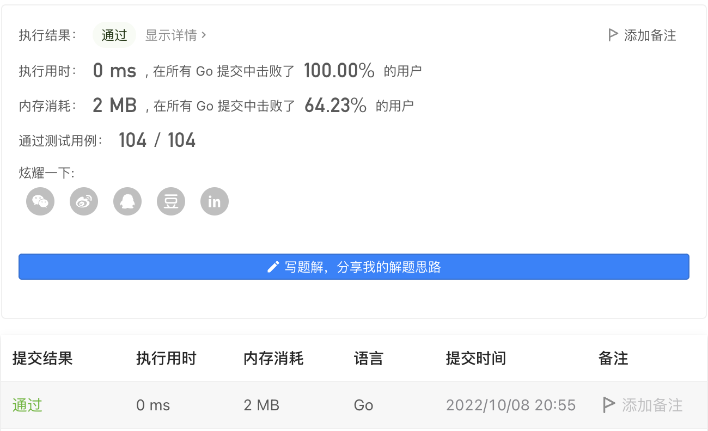

#### 1800. 最大升序子数组和

#### 2022-10-08 LeetCode每日一题

链接：https://leetcode.cn/problems/maximum-ascending-subarray-sum/

标签：**数组**

> 题目

给你一个正整数组成的数组 nums ，返回 nums 中一个 升序 子数组的最大可能元素和。

子数组是数组中的一个连续数字序列。

已知子数组 [numsl, numsl+1, ..., numsr-1, numsr] ，若对所有 i（l <= i < r），numsi < numsi+1 都成立，则称这一子数组为 升序 子数组。注意，大小为 1 的子数组也视作 升序 子数组。 

示例 1：

```java
输入：nums = [10,20,30,5,10,50]
输出：65
解释：[5,10,50] 是元素和最大的升序子数组，最大元素和为 65 。
```

示例 2：

```java
输入：nums = [10,20,30,40,50]
输出：150
解释：[10,20,30,40,50] 是元素和最大的升序子数组，最大元素和为 150 。 
```

示例 3：

```java
输入：nums = [12,17,15,13,10,11,12]
输出：33
解释：[10,11,12] 是元素和最大的升序子数组，最大元素和为 33 。 
```

示例 4：

```java
输入：nums = [100,10,1]
输出：100
```


提示：

- 1 <= nums.length <= 100
- 1 <= nums[i] <= 100

> 分析

循环，如果是升序，则累加，否则判断大小。具体看代码。

> 编码

```java
class Solution {
    public int maxAscendingSum(int[] nums) {
        int count = nums[0];
        int res = nums[0];

        for (int i = 1; i < nums.length; i++) {
            if (nums[i] > nums[i - 1]) {
                count += nums[i];
            } else {
                res = Math.max(res, count);
                count = nums[i];
            }
        }
        return Math.max(res, count);
    }
}
```



```go
func maxAscendingSum(nums []int) int {
    count, res := nums[0], nums[0]
    for i, n := 1, len(nums); i < n; i++ {
        if nums[i] > nums[i - 1] {
            count += nums[i]
        } else {
            if res < count {
                res = count
            }
            count = nums[i]
        }
    }
    if res < count {
        res = count
    }
    return res
}
```

